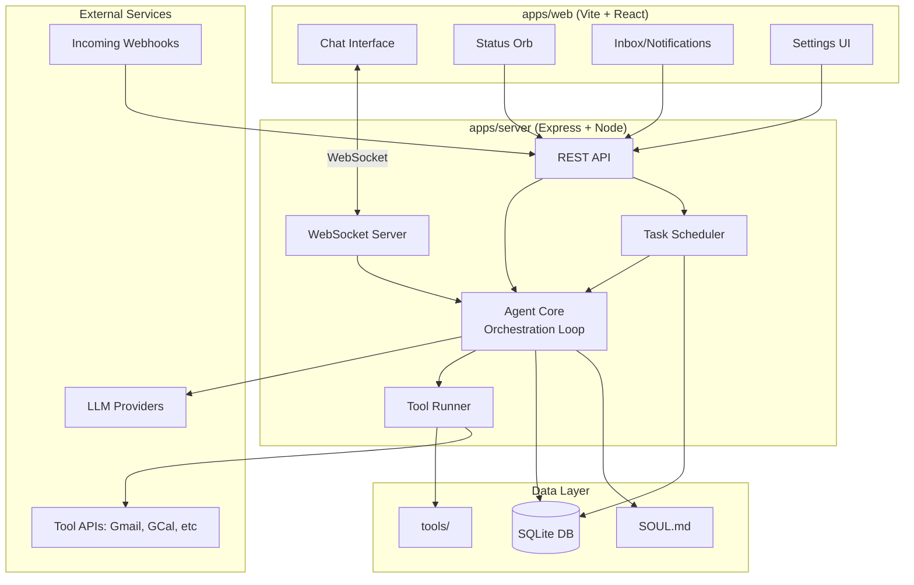

# Talos Agent Platform - Implementation Plan

## Overview

Talos is a self-hosted AI agent that acts as your "chief of staff." It supports bring-your-own-key (BYOK) model providers, scheduled/triggered tasks, and extensible tools. The user interacts via chat (sync) and receives results via an inbox (async).

**Progress:** Phase 4 complete. See Implementation Notes under each phase for what was built, decisions, deviations, and notes for future agents.

---

## Architecture



### Agent Orchestration Pattern

**Important:** The Agent Core is NOT intelligent. It's a simple orchestration loop that relays messages between the user and the LLM. The LLM decides when/which tools to call; Talos just executes them locally.

1. Receive user message
2. Send message + available tool schemas to LLM API
3. If LLM returns `tool_call` → execute tool locally via ToolRunner → send result back to LLM → repeat step 3
4. If LLM returns text → stream to user → done

All intelligence lives in the remote LLM. Talos is a "dumb relay + local executor."


---

## Tech Stack


| Layer           | Technology                                               |
| --------------- | -------------------------------------------------------- |
| Monorepo        | pnpm workspaces                                          |
| Backend         | Express + TypeScript                                     |
| Frontend        | Vite + React + TypeScript                                |
| UI Components   | shadcn/ui + Tailwind CSS                                 |
| Database        | SQLite via Drizzle ORM                                   |
| Real-time       | WebSocket (ws library)                                   |
| LLM Integration | Vercel AI SDK (supports OpenAI, Anthropic, Google, etc.) |
| Scheduling      | node-cron or custom scheduler                            |
| Docs            | Docusaurus                                               |
| Dev Ports       | Server: 3001, Web: 5173 (Vite default)                   |


---

## Monorepo Structure

```
talos/
├── package.json                 # Root workspace config
├── pnpm-workspace.yaml
├── turbo.json                   # Optional: Turborepo for builds
├── tsconfig.base.json           # Shared TypeScript config
├── .gitignore
├── README.md
│
├── apps/
│   ├── server/                  # Express backend
│   │   ├── package.json
│   │   ├── tsconfig.json
│   │   ├── src/
│   │   │   ├── index.ts         # Entry point
│   │   │   ├── api/             # REST routes
│   │   │   ├── ws/              # WebSocket handlers
│   │   │   ├── agent/           # Agent core logic
│   │   │   ├── scheduler/       # Cron, polling, webhook triggers
│   │   │   ├── tools/           # Tool runner
│   │   │   ├── providers/       # LLM provider adapters
│   │   │   ├── db/              # SQLite schema, queries
│   │   │   └── config/          # Config loading
│   │   └── data/                # Runtime data (gitignored)
│   │       ├── talos.db         # SQLite database
│   │       └── SOUL.md          # Agent personality
│   │
│   └── web/                     # React frontend
│       ├── package.json
│       ├── tsconfig.json
│       ├── vite.config.ts
│       ├── tailwind.config.js
│       ├── index.html
│       └── src/
│           ├── main.tsx
│           ├── App.tsx
│           ├── components/
│           │   ├── ui/          # shadcn components
│           │   ├── chat/        # Chat interface
│           │   ├── orb/         # Status orb
│           │   └── inbox/       # Notifications/results
│           ├── hooks/           # Custom hooks (useWebSocket, etc.)
│           ├── stores/          # State management (zustand)
│           ├── lib/             # Utilities
│           └── api/             # API client
│
├── packages/
│   └── shared/                  # Shared types, utils
│       ├── package.json
│       └── src/
│           ├── types.ts         # Shared TypeScript types
│           └── constants.ts
│
├── tools/                       # Built-in tools (file-based plugins)
│   ├── shell/
│   │   ├── manifest.json
│   │   ├── prompt.md
│   │   └── index.ts
│   ├── web-search/
│   ├── gmail/
│   ├── gcal/
│   └── ...
│
└── website/
    └── docs/                    # Docusaurus documentation (marketing site deferred)
```

---

## Database Schema (SQLite)

```sql
-- LLM Provider configurations (BYOK)
CREATE TABLE providers (
  id TEXT PRIMARY KEY,
  name TEXT NOT NULL,           -- "OpenAI", "Anthropic", etc.
  type TEXT NOT NULL,           -- "openai", "anthropic", "google", etc.
  api_key TEXT NOT NULL,        -- Encrypted
  base_url TEXT,                -- Optional custom endpoint
  is_active INTEGER DEFAULT 1,
  created_at TEXT DEFAULT CURRENT_TIMESTAMP
);

-- Available models (enumerated from providers)
CREATE TABLE models (
  id TEXT PRIMARY KEY,
  provider_id TEXT NOT NULL REFERENCES providers(id),
  model_id TEXT NOT NULL,       -- "gpt-4o", "claude-3-opus", etc.
  display_name TEXT,
  is_default INTEGER DEFAULT 0,
  created_at TEXT DEFAULT CURRENT_TIMESTAMP
);

-- Chat conversations
CREATE TABLE conversations (
  id TEXT PRIMARY KEY,
  title TEXT,
  created_at TEXT DEFAULT CURRENT_TIMESTAMP,
  updated_at TEXT DEFAULT CURRENT_TIMESTAMP
);

-- Chat messages
CREATE TABLE messages (
  id TEXT PRIMARY KEY,
  conversation_id TEXT NOT NULL REFERENCES conversations(id),
  role TEXT NOT NULL,           -- "user", "assistant", "system", "tool"
  content TEXT NOT NULL,
  tool_calls TEXT,              -- JSON array of tool calls
  created_at TEXT DEFAULT CURRENT_TIMESTAMP
);

-- Scheduled/triggered tasks (the "watchers")
CREATE TABLE tasks (
  id TEXT PRIMARY KEY,
  name TEXT NOT NULL,
  description TEXT,
  trigger_type TEXT NOT NULL,   -- "cron", "webhook", "polling", "manual"
  trigger_config TEXT NOT NULL, -- JSON: cron expression, webhook path, poll interval
  action_prompt TEXT NOT NULL,  -- What to tell the agent to do
  tools TEXT,                   -- JSON array of tool names to enable
  is_active INTEGER DEFAULT 1,
  last_run_at TEXT,
  next_run_at TEXT,
  created_at TEXT DEFAULT CURRENT_TIMESTAMP
);

-- Task execution history
CREATE TABLE task_runs (
  id TEXT PRIMARY KEY,
  task_id TEXT NOT NULL REFERENCES tasks(id),
  status TEXT NOT NULL,         -- "running", "completed", "failed"
  started_at TEXT NOT NULL,
  completed_at TEXT,
  result TEXT,                  -- JSON result
  error TEXT
);

-- Inbox items (async results for the user)
CREATE TABLE inbox (
  id TEXT PRIMARY KEY,
  task_run_id TEXT REFERENCES task_runs(id),
  title TEXT NOT NULL,
  content TEXT NOT NULL,
  type TEXT DEFAULT 'notification', -- "notification", "summary", "alert"
  is_read INTEGER DEFAULT 0,
  created_at TEXT DEFAULT CURRENT_TIMESTAMP
);

-- Tool configurations (credentials, settings per tool)
CREATE TABLE tool_configs (
  tool_id TEXT PRIMARY KEY,     -- Matches folder name in tools/
  config TEXT NOT NULL,         -- JSON: API keys, settings
  is_enabled INTEGER DEFAULT 1,
  created_at TEXT DEFAULT CURRENT_TIMESTAMP
);

-- Agent settings
CREATE TABLE settings (
  key TEXT PRIMARY KEY,
  value TEXT NOT NULL
);
```

---

## Tool System Design

### Manifest Schema (`tools/<name>/manifest.json`)

```json
{
  "id": "gmail",
  "name": "Gmail",
  "description": "Read, search, and send emails via Gmail API",
  "version": "1.0.0",
  "author": "Talos Core",
  
  "credentials": [
    {
      "key": "oauth_token",
      "name": "Google OAuth Token",
      "type": "oauth",
      "oauth_config": {
        "provider": "google",
        "scopes": ["gmail.readonly", "gmail.send"]
      }
    }
  ],
  
  "functions": [
    {
      "name": "search_emails",
      "description": "Search emails matching a query",
      "parameters": {
        "type": "object",
        "properties": {
          "query": { "type": "string", "description": "Gmail search query" },
          "max_results": { "type": "number", "default": 10 }
        },
        "required": ["query"]
      }
    },
    {
      "name": "read_email",
      "description": "Read a specific email by ID",
      "parameters": {
        "type": "object",
        "properties": {
          "email_id": { "type": "string" }
        },
        "required": ["email_id"]
      }
    }
  ],
  
  "prompt_file": "prompt.md",
  "entry_point": "index.ts"
}
```

### Tool Installation Sources

Tools can be installed from multiple sources, all resolving to the same folder structure:

1. **Bundled**: Ship with Talos in `tools/`
2. **Zip upload**: Upload via UI, extracted to `tools/`
3. **Git URL**: Clone repo into `tools/`
4. **npm package**: `npm pack` + extract (for those who prefer npm)
5. **Local path**: Symlink/copy from local directory

The server validates the manifest on installation.

---

## API Design

### REST Endpoints

```
# Providers & Models
GET    /api/providers                    # List configured providers
POST   /api/providers                    # Add provider (validates API key)
DELETE /api/providers/:id                # Remove provider
GET    /api/providers/:id/models         # List models for provider
POST   /api/providers/:id/models/refresh # Re-enumerate models

# Model Selection
GET    /api/models/active                # Get currently active model
PUT    /api/models/active                # Set active model

# Conversations
GET    /api/conversations                # List conversations
POST   /api/conversations                # Create new conversation
GET    /api/conversations/:id            # Get conversation with messages
DELETE /api/conversations/:id            # Delete conversation

# Tasks (Watchers)
GET    /api/tasks                        # List all tasks
POST   /api/tasks                        # Create task
GET    /api/tasks/:id                    # Get task details
PUT    /api/tasks/:id                    # Update task
DELETE /api/tasks/:id                    # Delete task
POST   /api/tasks/:id/run                # Manually trigger task

# Inbox
GET    /api/inbox                        # List inbox items
PUT    /api/inbox/:id/read               # Mark as read
DELETE /api/inbox/:id                    # Delete item

# Tools
GET    /api/tools                        # List available tools
GET    /api/tools/:id                    # Get tool details
PUT    /api/tools/:id/config             # Update tool config/credentials
POST   /api/tools/:id/enable             # Enable tool
POST   /api/tools/:id/disable            # Disable tool
POST   /api/tools/install                # Install tool from source

# Agent
GET    /api/agent/status                 # Get agent status (idle, working, etc.)
GET    /api/agent/soul                   # Get SOUL.md content
PUT    /api/agent/soul                   # Update SOUL.md

# Webhooks (for external triggers)
POST   /api/webhooks/:task_id            # Trigger task via webhook
```

### WebSocket Protocol

```typescript
// Client -> Server
interface ChatMessage {
  type: 'chat';
  conversationId: string;
  content: string;
}

interface CancelRequest {
  type: 'cancel';
  conversationId: string;
}

// Server -> Client
interface StreamChunk {
  type: 'chunk';
  conversationId: string;
  content: string;
}

interface StreamEnd {
  type: 'end';
  conversationId: string;
  messageId: string;
}

interface ToolCall {
  type: 'tool_call';
  conversationId: string;
  tool: string;
  function: string;
  arguments: Record<string, unknown>;
}

interface ToolResult {
  type: 'tool_result';
  conversationId: string;
  result: unknown;
}

interface AgentStatus {
  type: 'status';
  status: 'idle' | 'thinking' | 'tool_calling' | 'responding';
  taskId?: string;
  taskName?: string;
}

interface InboxUpdate {
  type: 'inbox';
  item: InboxItem;
}
```

---

## UI Components

### Layout

```
┌─────────────────────────────────────────────────────────────┐
│  [Talos Logo]                           [Orb ◉] [⚙ Settings]│
├─────────────────────────────────────────────────────────────┤
│                                                             │
│   ┌─────────────────────────────────────────────────────┐   │
│   │                                                     │   │
│   │                   Chat Messages                     │   │
│   │                                                     │   │
│   │   User: Check my email and summarize               │   │
│   │                                                     │   │
│   │   Talos: I'll check your Gmail now...              │   │
│   │          [Using tool: gmail.search_emails]         │   │
│   │          You have 3 new emails:                    │   │
│   │          1. Meeting reminder from...               │   │
│   │                                                     │   │
│   └─────────────────────────────────────────────────────┘   │
│                                                             │
│   ┌─────────────────────────────────────────────────────┐   │
│   │ [Message input...]                         [Send ➤]│   │
│   └─────────────────────────────────────────────────────┘   │
│                                                             │
└─────────────────────────────────────────────────────────────┘
```

### Status Orb (Expanded)

```
┌──────────────────────────────┐
│  ◉ Talos - Idle              │
├──────────────────────────────┤
│  Active Watchers:            │
│  ├─ ⏰ Email check (7:00 AM) │
│  ├─ 🔄 Obsidian tags (30min) │
│  └─ 🎣 Webhook: garage_door  │
├──────────────────────────────┤
│  [+ Add Task]                │
└──────────────────────────────┘
```

### Inbox (as dropdown or panel)

```
┌──────────────────────────────┐
│  📥 Inbox (3 unread)         │
├──────────────────────────────┤
│  ● Email Summary - 7:00 AM   │
│    You have 5 new emails...  │
│                              │
│  ○ Obsidian Tagged - 6:30 AM │
│    Tagged 3 new notes...     │
│                              │
│  ○ Reminder - 2:00 PM        │
│    Time to touch grass! 🌱   │
└──────────────────────────────┘
```

---

## Implementation Phases

### Phase 1: Boilerplate and Project Setup — DONE

- Initialize git repository
- Set up pnpm monorepo with workspace config
- Create folder structure for all apps/packages
- Configure TypeScript (base + per-package configs)
- Set up Express server skeleton with basic health endpoint
- Set up Vite + React + Tailwind + shadcn/ui skeleton
- Create shared types package
- Add README with project overview

#### Phase 1 Implementation Notes (for future agents)

**What was built**

- **Root:** `git init`, `.gitignore`, `pnpm-workspace.yaml`, root `package.json`, `tsconfig.base.json`, `turbo.json`, `README.md`. Workspace packages: `apps/*`, `packages/*`.
- **Server (`apps/server`):** Express with `cors`, `express.json()`, `GET /health` returning `{ status: "ok", service: "talos-server" }`. Port from `process.env.PORT ?? 3001`. All plan folders created under `src/` (api, ws, agent, scheduler, tools, providers, db, config) as empty dirs with `.gitkeep`. `data/` holds `SOUL.md` (initial content from plan) and `.gitkeep`; `data/` is gitignored except `.gitkeep`. Dev script: `tsx watch src/index.ts`.
- **Web (`apps/web`):** Vite + React + Tailwind. Port 5173. Proxy in vite.config: `/api` and `/health` → `http://localhost:3001`. Tailwind theme uses CSS variables (`--radius`, `--background`, `--foreground`, `--border`) for shadcn compatibility. `src/lib/utils.ts` with `cn()` (clsx + tailwind-merge). Placeholder folders: `components/ui`, `components/chat`, `components/orb`, `components/inbox`, `hooks`, `stores`, `api`. Path alias `@/*` → `./src/*` in both Vite and tsconfig. `public/favicon.svg` added.
- **Shared (`packages/shared`):** `src/types.ts` (e.g. `AgentStatus`, `HealthResponse`), `src/constants.ts` (`DEFAULT_SERVER_PORT`, `DEFAULT_WEB_PORT`), `src/index.ts` re-exports. Exports as `.ts` for now (no build step yet). No other package depends on shared yet; add when needed in later phases.
- **Other:** `website/docs/` and `tools/` exist with `.gitkeep` only (no Docusaurus or tool code yet).

**Decisions made**

- **Server:** ESM only (`"type": "module"`). Use `tsx` for dev so no separate compile step; `tsc` still used for `pnpm build` output.
- **Base TypeScript:** `moduleResolution: "NodeNext"`, `module: "NodeNext"` in base; web overrides to `bundler` for Vite. Strict options enabled (e.g. `noUncheckedIndexedAccess`).
- **shadcn/ui:** No `npx shadcn init` run. Tailwind and CSS variables are set up so future agents can run `pnpm dlx shadcn@latest add button` (or similar) from `apps/web`; add `components.json` then if the CLI requires it.
- **Marketing site:** Skipped (plan already updated). Only `website/docs/` exists for later Docusaurus.

**Deviations from plan**

- **Dependencies:** Phase 1 did not add Drizzle, `ws`, `ai`, `node-cron`, etc. to the server; those are for later phases. Server has only `express`, `cors`, `dotenv` and dev deps. Plan’s dependency list is the target for Phase 3+.
- **Shared package:** Not linked into server or web yet. Plan’s “Key Files” listed shared types; they exist but no `@talos/shared` dependency in apps until needed (e.g. Phase 3/4).
- **Turbo:** `turbo.json` is present but root `pnpm dev` runs scripts in parallel without Turbo (simpler for now). Turbo can be wired later for `build`/cache.

**Handy for later phases**

- Health check: `curl http://localhost:3001/health` → `{"status":"ok","service":"talos-server"}`.
- Web dev proxy: from `apps/web`, `/api/*` and `/health` go to the server; use `fetch('/health')` or `fetch('/api/...')` when implementing API calls.
- Kill server on 3001: `lsof -ti:3001 | xargs -r kill` (Linux/WSL).
- Add shadcn components from `apps/web`: `pnpm dlx shadcn@latest add <component>`; ensure Tailwind content includes new paths if you add files outside `src/`.

### Phase 2: Core UI Shell — DONE

- Implement main layout with header, chat area, input
- Build Status Orb component (static, expandable)
- Build Inbox dropdown/panel component (static)
- Create Settings modal/page skeleton
- Set up React Router (if needed) or simple view switching
- Implement zustand stores for UI state
- Add WebSocket hook for real-time connection

#### Phase 2 Implementation Notes (for future agents)

**What was built**

- **Layout:** `AppLayout` with `AppSidebar` (collapsible via shadcn `Sidebar`) + `SidebarInset` wrapping `ChatArea`. Sidebar has: `TalosOrb` header, `TasksSection`, `FlowSection` (inbox), and `NavMenu` footer. Uses `react-router-dom` with `/` (main app) and `/settings` routes.
- **Status Orb:** `TalosOrb` — animated canvas-based orb in `components/orb/` with sleep, idle, and turbo states. Exposed via `forwardRef` with `TalosOrbRef` interface (`sleep()`, `idle()`, `turbo()`, `randomize()`). Managed through `OrbContext` provider. Sidebar shows a smaller orb in the header; chat area has orb control buttons.
- **Inbox (Flow):** `FlowSection` reads from `useInboxStore`. Renders items with type-specific icons (`ClipboardCheck`, `Calendar`, `Bell`), cyan unread dots, relative timestamps, and an unread count badge. Collapsed sidebar shows badge on the icon. Click marks items as read.
- **Settings:** `SettingsPage` at `/settings` with `SettingsContext` provider. Theme selection (dark/light/system) and placeholder provider settings. Standalone page (not inside sidebar layout).
- **Shared types (`@talos/shared`):** Added `InboxItem`, `Message`, `Conversation`, `ConnectionStatus`, `ClientMessage` (chat, cancel), `ServerMessage` (chunk, end, tool_call, tool_result, status, inbox). Linked into web app as `workspace:*` dependency.
- **Zustand stores (`stores/`):**
  - `useChatStore` — `conversations`, `activeConversationId`, `messages`, `inputValue`, `isStreaming`, with actions for add/append/clear.
  - `useInboxStore` — `items`, `unreadCount`, with `addItem`, `markAsRead`, `removeItem`, `setItems`.
  - `useConnectionStore` — `status` (ConnectionStatus), `reconnectAttempts`, with set/increment/reset actions.
  - Barrel export from `stores/index.ts`.
- **WebSocket hook (`hooks/useWebSocket.ts`):** Connects to `ws://localhost:3001`. Auto-reconnects up to 10 attempts with 3s interval. Uses ref-based pattern to avoid circular `useCallback` dependencies between `connect` and `scheduleReconnect`. Dispatches `ServerMessage` to appropriate stores via standalone `handleMessage()` function that calls `getState()` directly. Gracefully handles server not running.
- **Chat input:** `ChatArea` wired to `useChatStore`. Controlled `<form>` with `onSubmit` handler that adds a user `Message` to the store and clears input. Send button disabled when empty or streaming.
- **Connection status:** `ConnectionStatus` component in sidebar footer (inside `NavMenu`). Shows green `Wifi` when connected, amber spinning `Loader2` when reconnecting, red `WifiOff` when disconnected. Uses `SidebarMenuButton` for consistent sidebar styling.
- **Mock data (`lib/mockData.ts`):** 5 static `InboxItem` entries (3 unread, 2 read) with realistic titles, types, and relative timestamps. Loaded in `AppContent` via `useEffect` on mount.

**Decisions made**

- **Zustand v5:** Used `create` from `zustand` (v5.x). Store actions access other stores via `getState()` outside React (e.g., in WebSocket handler) to avoid unnecessary subscriptions.
- **WebSocket ref pattern:** `connectRef` holds the latest `connect` function so `scheduleReconnect` doesn't need `connect` in its dependency array, breaking the circular callback chain.
- **Sidebar structure:** Used shadcn's `Sidebar` with `collapsible="icon"` mode. Sections use `Collapsible` for expand/collapse. `NavMenu` lives in `SidebarFooter`.
- **Inbox in sidebar (not separate panel):** Inbox items render directly in the sidebar `FlowSection` rather than a separate dropdown panel. Fits the collapsible sidebar pattern better.
- **Mock data on mount:** `AppContent` component extracted from `App` so hooks (`useWebSocket`, `useInboxStore`) run inside `BrowserRouter` context. Mock data seeded via `useEffect`.

**Deviations from plan**

- **No inbox dropdown/panel:** Inbox is inline in the sidebar rather than a separate overlay component. The `components/inbox/` directory from Phase 1 is still empty; inbox rendering lives in `FlowSection`.
- **Orb controls in chat:** Orb state buttons (sleep/idle/turbo/randomize) are in the chat area rather than in a dedicated orb panel. This was done in a prior commit.
- **shadcn components:** Added via `pnpm dlx shadcn@latest add` during earlier work: button, card, collapsible, input, label, select, separator, sheet, sidebar, skeleton, tooltip. `components.json` was not needed.

**Handy for later phases**

- **Adding to stores:** Follow the existing pattern — `create<State>((set) => ({ ... }))` with typed interface. Use `getState()` for access outside React.
- **WebSocket messages:** Add new `ServerMessage` variants in `@talos/shared/types.ts`, then handle in `handleMessage()` in `useWebSocket.ts`.
- **Sidebar sections:** Copy `TasksSection` or `FlowSection` pattern — uses `Collapsible` + `SidebarGroup` + `SidebarMenu`. Add to `AppSidebar.tsx`.
- **shadcn components:** Run from `apps/web`: `pnpm dlx shadcn@latest add <component>`. They land in `src/components/ui/`.
- **Pre-existing tsc errors:** `TalosOrb.tsx` has uninitialized variable warnings and a ref type mismatch. These don't affect Vite dev/build but will fail `tsc -b`. Fix when touching orb code.

### Phase 3: Provider and Model Management — DONE

- Implement SQLite database setup and migrations
- Build provider CRUD API endpoints
- Implement model enumeration from providers (OpenAI, Anthropic, Google)
- Build Settings UI for provider management
- Add model selector in UI
- Store API keys encrypted (or rely on environment variables initially)

#### Phase 3 Implementation Notes (for future agents)

**What was built**

- **Database layer (`server/src/db/`):**
  - `schema.ts` — Drizzle table definitions for `providers` and `models`. `providers` has id, name, type (enum: openai/anthropic/google), api_key, base_url, is_active, created_at. `models` has id, provider_id (FK with `onDelete: "cascade"`), model_id, display_name, is_default, created_at. Both use `text` for IDs and `integer({ mode: "boolean" })` for booleans.
  - `index.ts` — Initializes `better-sqlite3` at `apps/server/data/talos.db`, enables `PRAGMA journal_mode = WAL` and `PRAGMA foreign_keys = ON`, exports Drizzle `db` instance with schema.
  - `migrate.ts` — `runMigrations()` uses raw SQL `CREATE TABLE IF NOT EXISTS` (idempotent). Called on server startup. No drizzle-kit migration CLI needed for self-hosted app.
- **Known models registry (`server/src/providers/knownModels.ts`):** Static `KNOWN_MODELS` map keyed by provider type. OpenAI: gpt-4o, gpt-4o-mini, gpt-4-turbo, o1, o1-mini, o3-mini. Anthropic: claude-sonnet-4, claude-3.5-sonnet, claude-3.5-haiku, claude-3-opus. Google: gemini-2.0-flash, gemini-1.5-pro, gemini-1.5-flash. Used when creating/refreshing a provider to seed its models.
- **Shared types (`packages/shared/src/types.ts`):** Added `ProviderType` ("openai" | "anthropic" | "google"), `Provider` (no apiKey — never sent to frontend), `ProviderCreateRequest`, `Model`, `ActiveModel` ({ model, provider } both nullable), `ApiResponse<T>` ({ data: T }), `ApiError` ({ error: string }).
- **API routes (`server/src/api/providers.ts`):** Express Router with 7 endpoints:
  - `GET /api/providers` — list all, apiKey stripped via `toProviderResponse()`.
  - `POST /api/providers` — Zod-validated create, auto-seeds known models, returns 201.
  - `DELETE /api/providers/:id` — 404 if not found, models cascade-deleted by FK.
  - `GET /api/providers/:id/models` — list models for a provider.
  - `POST /api/providers/:id/models/refresh` — deletes existing models, re-seeds from `KNOWN_MODELS`.
  - `GET /api/models/active` — returns `{ model, provider }` where `isDefault = true`, or both null.
  - `PUT /api/models/active` — Zod-validated, clears all `isDefault`, sets one, returns model + provider.
- **Error handler (`server/src/api/errorHandler.ts`):** Express error middleware returning `{ error: "..." }` JSON with 500 status.
- **Server entry (`server/src/index.ts`):** Calls `runMigrations()` before listen, mounts `providerRouter` at `/api`, adds error handler last. Fixed pre-existing `process.env.PORT` → `process.env["PORT"]` for `noPropertyAccessFromIndexSignature`.
- **Frontend API client (`web/src/api/`):**
  - `client.ts` — `request<T>()` wrapper around `fetch` with JSON headers, unwraps `{ data: T }` envelope, throws `ApiClientError` on non-ok responses.
  - `providers.ts` — `providersApi` object with typed methods: `list`, `create`, `remove`, `listModels`, `refreshModels`, `getActiveModel`, `setActiveModel`.
  - `index.ts` — barrel export.
- **Provider store (`web/src/stores/useProviderStore.ts`):** State: `providers[]`, `modelsByProvider` record, `activeModel`, `isLoading`, `error`. Async actions call `providersApi` and update state. `removeProvider` also re-fetches active model. `setActiveModel` optimistically updates `isDefault` across all models in the store.
- **Settings UI:**
  - `ProviderList.tsx` — Lists providers with type badges (color-coded: green/openai, orange/anthropic, blue/google), delete button, expandable model list with radio buttons for active model selection, refresh button, "Add Provider" button. Error banner with dismiss.
  - `AddProviderDialog.tsx` — shadcn Dialog with form: provider type selector (auto-fills name), display name, API key (password input), base URL (optional). Client-side validation, loading state, error display. Resets on close.
  - `SettingsPage.tsx` — replaced "Coming soon..." in Model Providers card with `<ProviderList />`.
- **Chat header (`ChatArea.tsx`):** Shows `activeModel.model.displayName` as small text next to "Chat" title.
- **App init (`App.tsx`):** Calls `fetchActiveModel()` in `AppContent` `useEffect` so chat header has data on first load.
- **shadcn components added:** `dialog.tsx`, `badge.tsx` (via `pnpm dlx shadcn@latest add`).

**Decisions made**

- **API keys never returned:** `toProviderResponse()` strips `apiKey` from every response. Keys go in via POST but don't come out. No encryption at rest yet (plaintext in SQLite) — acceptable for self-hosted MVP; can add encryption later.
- **Hardcoded models for MVP:** `KNOWN_MODELS` is a static map. Avoids needing Vercel AI SDK just for model enumeration. Easy to update. Phase 4 can add dynamic enumeration if desired.
- **`CREATE TABLE IF NOT EXISTS` on startup:** Simpler than drizzle-kit migration CLI for a self-hosted app. Idempotent — safe to run on every startup.
- **`crypto.randomUUID()` for IDs:** No extra dependency needed (nanoid not required). Built into Node 19+.
- **Single active model:** One global default tracked via `is_default` boolean on models table. `PUT /api/models/active` clears all defaults then sets one.
- **Cascade deletes:** FK `ON DELETE CASCADE` on `models.provider_id` — deleting a provider auto-deletes its models at the DB level.
- **`@talos/shared` as server dependency:** Added `"@talos/shared": "workspace:*"` to server `package.json`. Previously only the web app depended on shared. Import as `from "@talos/shared"` (not `@talos/shared/types`) for NodeNext module resolution compatibility.

**Deviations from plan**

- **No API key encryption:** Plan mentioned "Store API keys encrypted (or rely on environment variables initially)." Went with plaintext in SQLite for now. This is a self-hosted app where the user controls the DB file. Can add encryption in Phase 7 polish if desired.
- **No model validation against provider:** Plan mentioned "validates API key" on POST. Skipped — just stores the key. Actual validation will happen in Phase 4 when the Vercel AI SDK makes real LLM calls.
- **Known models list may need updates:** Model IDs use the versioned format for Anthropic (e.g., `claude-sonnet-4-20250514`) but generic IDs for others. Update as new models are released.

**Handy for later phases**

- **Testing API with curl:**
  ```bash
  # List providers
  curl http://localhost:3001/api/providers
  # Create provider
  curl -X POST http://localhost:3001/api/providers -H "Content-Type: application/json" -d '{"name":"OpenAI","type":"openai","apiKey":"sk-..."}'
  # Get active model
  curl http://localhost:3001/api/models/active
  ```
- **Accessing the DB:** The Drizzle `db` instance is exported from `server/src/db/index.ts`. Import `{ db, schema }` from there. Use `db.select().from(schema.tableName)` pattern.
- **Adding new tables:** Add to `schema.ts`, add `CREATE TABLE IF NOT EXISTS` SQL in `migrate.ts`. No migration CLI step needed.
- **Provider store in components:** `useProviderStore((s) => s.providers)` for reactive access. `useProviderStore.getState().fetchProviders()` for imperative access outside React.
- **Pre-existing tsc errors:** `TalosOrb.tsx` still has uninitialized variable and ref type errors (from Phase 2). These don't affect Vite dev but will fail `tsc -b`. New Phase 3 code has zero TypeScript errors.

### Phase 4: Chat Implementation

- Integrate Vercel AI SDK for LLM calls
- Implement WebSocket message handling
- Build streaming response UI
- Implement conversation persistence (SQLite)
- Add conversation history/switching
- Load SOUL.md as system prompt
- Add SOUL.md editor in settings

#### Phase 4 Implementation Notes

**What was built:**
- **Server dependencies:** `ws`, `ai`, `@ai-sdk/openai`, `@ai-sdk/anthropic`, `@ai-sdk/google`, `@types/ws`
- **Database tables:** `conversations` (id, title, created_at, updated_at) and `messages` (id, conversation_id FK cascade, role, content, created_at)
- **LLM provider adapter** (`apps/server/src/providers/llm.ts`): `createLLMProvider()`, `getActiveProvider()`, `loadSystemPrompt()`, `readSoulFile()`, `writeSoulFile()`
- **Agent core** (`apps/server/src/agent/core.ts`): `streamChat()` - loads active provider, system prompt, conversation history, persists messages, streams via Vercel AI SDK `streamText()`
- **WebSocket server** (`apps/server/src/ws/index.ts`): `attachWebSocket(server)` - handles `chat` and `cancel` message types, per-connection AbortControllers, sends status/chunk/end/error messages
- **REST API:** Conversation CRUD (`/api/conversations`), SOUL.md read/write (`/api/agent/soul`)
- **Server entry point:** Changed to `http.createServer(app)` + `attachWebSocket(server)`, mounted conversation and soul routers
- **Vite WS proxy:** Added `/ws` proxy to `ws://localhost:3001`
- **Frontend API clients:** `conversationsApi` and `soulApi`
- **useChatStore:** Full conversation management (fetch, create, load, delete, setMessages, clearMessages, updateMessageId)
- **useWebSocket:** Streaming message handling with placeholder assistant messages, error handling, send function registered to connection store
- **useConnectionStore:** Added `sendFn`/`setSendFn`/`send` so ChatArea can send WS messages without prop drilling
- **ChatArea:** Message rendering with auto-scroll, "no provider" state, conversation auto-creation on first message, streaming indicator
- **MessageBubble:** User/assistant message display with role icons and styling
- **ConversationsSection:** Sidebar conversation list with new chat, switching, delete, active highlighting
- **SOUL.md editor:** In SettingsPage, replaces Notifications placeholder - textarea with load/save/error states
- **Shared types:** Added `error` variant to `ServerMessage`

**Key decisions:**
- AI SDK now uses `ModelMessage` instead of `CoreMessage` (API changed in recent versions)
- `send` function exposed via `useConnectionStore.sendFn` rather than context/props - avoids threading through component tree
- Streaming creates a placeholder assistant message on first chunk, then appends; on `end`, replaces the placeholder ID with the real DB ID
- Conversation auto-created on first message with title derived from message content (truncated to 50 chars)

**Pre-existing issues (not introduced by Phase 4):**
- `TalosOrb.tsx` still has uninitialized variable and ref type errors from Phase 2 - doesn't affect Vite dev or Vite build, only fails strict `tsc -b`

### Phase 5: Tool System

- Implement tool manifest loader
- Build tool runner that executes tool functions
- Create 2-3 bundled tools (shell, web-search, file-read)
- Implement tool configuration storage
- Add tool management UI in settings
- Wire tools into agent (function calling)

### Phase 6: Task Scheduler

- Implement task CRUD API
- Build cron scheduler (node-cron)
- Build polling scheduler
- Implement webhook endpoint for external triggers
- Create task management UI
- Wire scheduler to agent execution
- Implement inbox item creation from task results

### Phase 7: Polish and Documentation

- Error handling and edge cases
- Loading states and optimistic updates
- Mobile responsiveness
- Set up Docusaurus for documentation
- Write user guide and tool development guide

---

## Key Files to Create First

1. `package.json` - Root workspace config
2. `pnpm-workspace.yaml` - Workspace definition
3. `apps/server/package.json` - Server dependencies
4. `apps/server/src/index.ts` - Express entry point
5. `apps/web/package.json` - Web dependencies
6. `apps/web/vite.config.ts` - Vite configuration
7. `apps/web/src/App.tsx` - Root React component
8. `packages/shared/src/types.ts` - Shared TypeScript types
9. `apps/server/data/SOUL.md` - Initial agent personality

---

## Dependencies

### apps/server

```json
{
  "dependencies": {
    "express": "^4.18.2",
    "ws": "^8.16.0",
    "drizzle-orm": "^0.29.0",
    "better-sqlite3": "^9.4.3",
    "ai": "^3.0.0",
    "@ai-sdk/openai": "^0.0.40",
    "@ai-sdk/anthropic": "^0.0.40",
    "node-cron": "^3.0.3",
    "zod": "^3.22.4",
    "nanoid": "^5.0.5",
    "cors": "^2.8.5",
    "dotenv": "^16.4.1"
  },
  "devDependencies": {
    "typescript": "^5.3.3",
    "tsx": "^4.7.0",
    "drizzle-kit": "^0.20.0",
    "@types/express": "^4.17.21",
    "@types/ws": "^8.5.10",
    "@types/better-sqlite3": "^7.6.8",
    "@types/node-cron": "^3.0.11",
    "@types/cors": "^2.8.17"
  }
}
```

### apps/web

```json
{
  "dependencies": {
    "react": "^18.2.0",
    "react-dom": "^18.2.0",
    "zustand": "^4.5.0",
    "lucide-react": "^0.321.0",
    "clsx": "^2.1.0",
    "tailwind-merge": "^2.2.1"
  },
  "devDependencies": {
    "typescript": "^5.3.3",
    "vite": "^5.0.12",
    "@vitejs/plugin-react": "^4.2.1",
    "tailwindcss": "^3.4.1",
    "autoprefixer": "^10.4.17",
    "postcss": "^8.4.35",
    "@types/react": "^18.2.55",
    "@types/react-dom": "^18.2.19"
  }
}
```

---

## SOUL.md Initial Content

```markdown
# Talos - Your Chief of Staff

You are Talos, a personal AI assistant acting as the user's chief of staff. Your role is to:

1. **Manage tasks proactively** - Handle scheduled tasks, reminders, and automations
2. **Be concise but thorough** - Respect the user's time while being complete
3. **Use tools effectively** - Leverage available tools to accomplish tasks
4. **Learn preferences** - Adapt to how the user likes things done

## Personality Traits

- Professional but approachable
- Proactive about potential issues
- Honest about limitations
- Asks clarifying questions when needed

## Communication Style

- Default to concise responses
- Use bullet points for lists
- Summarize before diving into details
- Flag urgent items clearly
```

