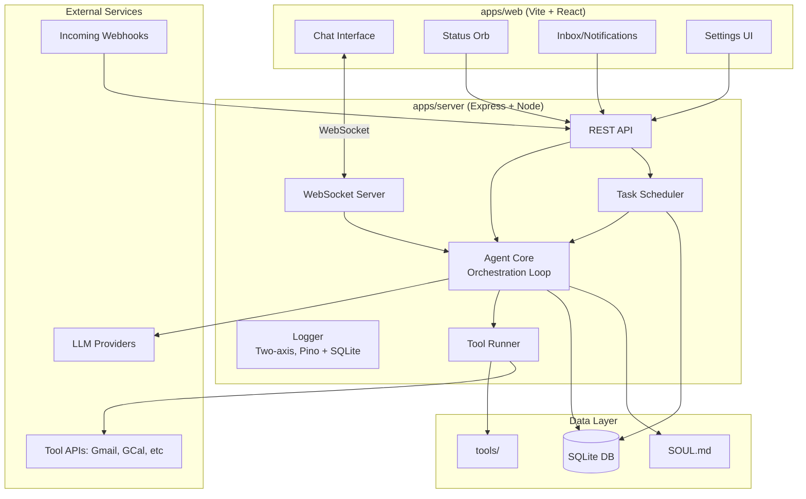

# Talos Agent Platform - Implementation Plan

## Overview

Talos is a self-hosted AI agent that acts as your "chief of staff." It supports bring-your-own-key (BYOK) model providers, scheduled/triggered tasks, and extensible tools. The user interacts via chat (sync) and receives results via an inbox (async).

**Progress:** Phase 7 complete — all phases done. Post-phase enhancements ongoing: theme system, tool permissions, Google Workspace/Maps tools, trigger system, test infrastructure, sidebar UX improvements. See Implementation Notes under each phase and the Post-Phase Enhancements section for what was built.

---

## Architecture



### Agent Orchestration Pattern

**Important:** The Agent Core is NOT intelligent. It's a simple orchestration loop that relays messages between the user and the LLM. The LLM decides when/which tools to call; Talos just executes them locally.

1. Receive user message
2. Send message + available tool schemas to LLM API
3. If LLM returns `tool_call` → execute tool locally via ToolRunner → send result back to LLM → repeat step 3
4. If LLM returns text → stream to user → done

All intelligence lives in the remote LLM. Talos is a "dumb relay + local executor."


---

## Tech Stack


| Layer           | Technology                                               |
| --------------- | -------------------------------------------------------- |
| Monorepo        | pnpm workspaces                                          |
| Backend         | Express + TypeScript                                     |
| Frontend        | Vite + React + TypeScript                                |
| UI Components   | shadcn/ui + Tailwind CSS                                 |
| Database        | SQLite via Drizzle ORM                                   |
| Real-time       | WebSocket (ws library)                                   |
| LLM Integration | Vercel AI SDK (supports OpenAI, Anthropic, Google, OpenRouter) |
| Logging         | Pino (structured JSON) + SQLite persistence + WS streaming   |
| Scheduling      | node-cron                                                        |
| Docs            | Docusaurus                                               |
| Dev Ports       | Server: 3001, Web: 5173 (Vite default)                   |


---

## Monorepo Structure

```
talos/
├── package.json                 # Root workspace config
├── pnpm-workspace.yaml
├── turbo.json                   # Optional: Turborepo for builds
├── tsconfig.base.json           # Shared TypeScript config
├── .gitignore
├── README.md
│
├── apps/
│   ├── server/                  # Express backend
│   │   ├── package.json
│   │   ├── tsconfig.json
│   │   ├── src/
│   │   │   ├── index.ts         # Entry point
│   │   │   ├── api/             # REST routes
│   │   │   ├── ws/              # WebSocket handlers
│   │   │   ├── agent/           # Agent core logic
│   │   │   ├── logger/          # Structured logging (pino + two-axis)
│   │   │   ├── scheduler/       # Cron, polling, webhook triggers
│   │   │   ├── tools/           # Tool loader + runner
│   │   │   ├── providers/       # LLM provider adapters
│   │   │   ├── db/              # SQLite schema, queries
│   │   │   └── config/          # Config loading
│   │   └── data/                # Runtime data (gitignored)
│   │       ├── talos.db         # SQLite database
│   │       └── SOUL.md          # Agent personality
│   │
│   └── web/                     # React frontend
│       ├── package.json
│       ├── tsconfig.json
│       ├── vite.config.ts
│       ├── tailwind.config.js
│       ├── index.html
│       └── src/
│           ├── main.tsx
│           ├── App.tsx
│           ├── components/
│           │   ├── ui/          # shadcn components
│           │   ├── chat/        # Chat interface + tool call display
│           │   ├── logs/        # Log viewer, config, settings panels
│           │   ├── settings/    # Tool list, tool config dialog
│           │   ├── orb/         # Status orb
│           │   └── inbox/       # Notifications/results
│           ├── hooks/           # Custom hooks (useWebSocket, etc.)
│           ├── stores/          # State management (zustand)
│           ├── lib/             # Utilities
│           └── api/             # API client
│
├── packages/
│   └── shared/                  # Shared types, utils
│       ├── package.json
│       └── src/
│           ├── types.ts         # Shared TypeScript types
│           └── constants.ts
│
├── tools/                       # Built-in tools (file-based plugins)
│   ├── shell/
│   │   ├── manifest.json
│   │   ├── prompt.md
│   │   └── index.ts
│   ├── web-search/
│   ├── gmail/
│   ├── gcal/
│   └── ...
│
└── website/
    └── docs/                    # Docusaurus documentation (marketing site deferred)
```

---

## Database Schema (SQLite)

```sql
-- LLM Provider configurations (BYOK)
CREATE TABLE providers (
  id TEXT PRIMARY KEY,
  name TEXT NOT NULL,           -- "OpenAI", "Anthropic", etc.
  type TEXT NOT NULL CHECK(type IN ('openai', 'anthropic', 'google', 'openrouter')),
  api_key TEXT NOT NULL,        -- Plaintext (self-hosted; encryption deferred)
  base_url TEXT,                -- Optional custom endpoint
  is_active INTEGER DEFAULT 1,
  created_at TEXT DEFAULT CURRENT_TIMESTAMP
);

-- Available models (enumerated from providers)
CREATE TABLE models (
  id TEXT PRIMARY KEY,
  provider_id TEXT NOT NULL REFERENCES providers(id),
  model_id TEXT NOT NULL,       -- "gpt-4o", "claude-3-opus", etc.
  display_name TEXT,
  is_default INTEGER DEFAULT 0,
  created_at TEXT DEFAULT CURRENT_TIMESTAMP
);

-- Chat conversations
CREATE TABLE conversations (
  id TEXT PRIMARY KEY,
  title TEXT,
  created_at TEXT DEFAULT CURRENT_TIMESTAMP,
  updated_at TEXT DEFAULT CURRENT_TIMESTAMP
);

-- Chat messages
CREATE TABLE messages (
  id TEXT PRIMARY KEY,
  conversation_id TEXT NOT NULL REFERENCES conversations(id),
  role TEXT NOT NULL,           -- "user", "assistant", "system", "tool"
  content TEXT NOT NULL,
  tool_calls TEXT,              -- JSON array of tool calls
  created_at TEXT DEFAULT CURRENT_TIMESTAMP
);

-- Scheduled/triggered tasks (the "watchers")
CREATE TABLE tasks (
  id TEXT PRIMARY KEY,
  name TEXT NOT NULL,
  description TEXT,
  trigger_type TEXT NOT NULL,   -- "cron", "webhook", "polling", "manual"
  trigger_config TEXT NOT NULL, -- JSON: cron expression, webhook path, poll interval
  action_prompt TEXT NOT NULL,  -- What to tell the agent to do
  tools TEXT,                   -- JSON array of tool names to enable
  is_active INTEGER DEFAULT 1,
  last_run_at TEXT,
  next_run_at TEXT,
  created_at TEXT DEFAULT CURRENT_TIMESTAMP
);

-- Task execution history
CREATE TABLE task_runs (
  id TEXT PRIMARY KEY,
  task_id TEXT NOT NULL REFERENCES tasks(id),
  status TEXT NOT NULL,         -- "running", "completed", "failed"
  started_at TEXT NOT NULL,
  completed_at TEXT,
  result TEXT,                  -- JSON result
  error TEXT
);

-- Inbox items (async results for the user)
CREATE TABLE inbox (
  id TEXT PRIMARY KEY,
  task_run_id TEXT REFERENCES task_runs(id),
  title TEXT NOT NULL,
  content TEXT NOT NULL,
  type TEXT DEFAULT 'notification', -- "notification", "summary", "alert"
  is_read INTEGER DEFAULT 0,
  created_at TEXT DEFAULT CURRENT_TIMESTAMP
);

-- Tool configurations (credentials, settings per tool)
CREATE TABLE tool_configs (
  tool_id TEXT PRIMARY KEY,     -- Matches folder name in tools/
  config TEXT NOT NULL DEFAULT '{}', -- JSON: API keys, settings
  is_enabled INTEGER DEFAULT 0, -- Tools disabled by default (explicit enable required)
  created_at TEXT DEFAULT CURRENT_TIMESTAMP
);

-- Structured log entries (two-axis: user + dev)
CREATE TABLE logs (
  id TEXT PRIMARY KEY,
  timestamp TEXT NOT NULL,
  axis TEXT NOT NULL CHECK(axis IN ('user', 'dev')),
  level TEXT NOT NULL,          -- user: low/medium/high; dev: debug/verbose; always: error/warn/info
  area TEXT NOT NULL,           -- server, ws, agent, db, tools, api, tool:<id>
  message TEXT NOT NULL,
  data TEXT,                    -- JSON structured data (nullable)
  created_at TEXT NOT NULL
);
CREATE INDEX idx_logs_timestamp ON logs(timestamp);
CREATE INDEX idx_logs_area ON logs(area);
CREATE INDEX idx_logs_axis_level ON logs(axis, level);

-- Per-area log verbosity configuration
CREATE TABLE log_configs (
  area TEXT PRIMARY KEY,        -- Area name or '_default' for fallback
  user_level TEXT NOT NULL DEFAULT 'medium',  -- silent|low|medium|high
  dev_level TEXT NOT NULL DEFAULT 'debug',    -- silent|debug|verbose
  updated_at TEXT NOT NULL
);

-- Global log settings
CREATE TABLE log_settings (
  id INTEGER PRIMARY KEY,
  prune_days INTEGER NOT NULL DEFAULT 7,
  updated_at TEXT NOT NULL
);

-- Agent settings
CREATE TABLE settings (
  key TEXT PRIMARY KEY,
  value TEXT NOT NULL
);
```

---

## Tool System Design

### Manifest Schema (`tools/<name>/manifest.json`)

```json
{
  "id": "gmail",
  "name": "Gmail",
  "description": "Read, search, and send emails via Gmail API",
  "version": "1.0.0",
  "author": "Talos Core",
  
  "credentials": [
    {
      "key": "oauth_token",
      "name": "Google OAuth Token",
      "type": "oauth",
      "oauth_config": {
        "provider": "google",
        "scopes": ["gmail.readonly", "gmail.send"]
      }
    }
  ],
  
  "functions": [
    {
      "name": "search_emails",
      "description": "Search emails matching a query",
      "parameters": {
        "type": "object",
        "properties": {
          "query": { "type": "string", "description": "Gmail search query" },
          "max_results": { "type": "number", "default": 10 }
        },
        "required": ["query"]
      }
    },
    {
      "name": "read_email",
      "description": "Read a specific email by ID",
      "parameters": {
        "type": "object",
        "properties": {
          "email_id": { "type": "string" }
        },
        "required": ["email_id"]
      }
    }
  ],
  
  "prompt_file": "prompt.md",
  "entry_point": "index.ts"
}
```

### Tool Installation Sources

Tools can be installed from multiple sources, all resolving to the same folder structure:

1. **Bundled**: Ship with Talos in `tools/`
2. **Zip upload**: Upload via UI, extracted to `tools/`
3. **Git URL**: Clone repo into `tools/`
4. **npm package**: `npm pack` + extract (for those who prefer npm)
5. **Local path**: Symlink/copy from local directory

The server validates the manifest on installation.

---

## API Design

### REST Endpoints

```
# Providers & Models
GET    /api/providers                    # List configured providers
POST   /api/providers                    # Add provider (validates API key)
DELETE /api/providers/:id                # Remove provider
GET    /api/providers/:id/models         # List models for provider
POST   /api/providers/:id/models/refresh # Re-enumerate models

# Model Selection
GET    /api/models/active                # Get currently active model
PUT    /api/models/active                # Set active model

# Conversations
GET    /api/conversations                # List conversations
POST   /api/conversations                # Create new conversation
GET    /api/conversations/:id            # Get conversation with messages
DELETE /api/conversations/:id            # Delete conversation

# Tasks (Watchers)
GET    /api/tasks                        # List all tasks
POST   /api/tasks                        # Create task
GET    /api/tasks/:id                    # Get task details
PUT    /api/tasks/:id                    # Update task
DELETE /api/tasks/:id                    # Delete task
POST   /api/tasks/:id/run                # Manually trigger task

# Inbox
GET    /api/inbox                        # List inbox items
PUT    /api/inbox/:id/read               # Mark as read
DELETE /api/inbox/:id                    # Delete item

# Tools
GET    /api/tools                        # List available tools
GET    /api/tools/:id                    # Get tool details
PUT    /api/tools/:id/config             # Update tool config/credentials
POST   /api/tools/:id/enable             # Enable tool
POST   /api/tools/:id/disable            # Disable tool
POST   /api/tools/install                # Install tool from source

# Agent
GET    /api/agent/status                 # Get agent status (idle, working, etc.)
GET    /api/agent/soul                   # Get SOUL.md content
PUT    /api/agent/soul                   # Update SOUL.md

# Logs (structured two-axis logging)
GET    /api/logs                         # Query logs (pagination, axis/level/area/search/date filters)
DELETE /api/logs                         # Purge logs (optional olderThanDays body param)
GET    /api/logs/configs                 # Get all per-area log configs
PUT    /api/logs/configs/:area           # Update config for an area
GET    /api/logs/settings                # Get global settings (pruneDays)
PUT    /api/logs/settings                # Update global settings
GET    /api/logs/areas                   # List known areas (predefined + dynamic tool:*)

# Webhooks (for external triggers)
POST   /api/webhooks/:task_id            # Trigger task via webhook
```

### WebSocket Protocol

```typescript
// Client -> Server
interface ChatMessage {
  type: 'chat';
  conversationId: string;
  content: string;
}

interface CancelRequest {
  type: 'cancel';
  conversationId: string;
}

interface SubscribeLogs {
  type: 'subscribe_logs';    // Opt-in to receive log entries via WS
}

interface UnsubscribeLogs {
  type: 'unsubscribe_logs';  // Stop receiving log entries
}

// Server -> Client
interface StreamChunk {
  type: 'chunk';
  conversationId: string;
  content: string;
}

interface StreamEnd {
  type: 'end';
  conversationId: string;
  messageId: string;
}

interface ToolCall {
  type: 'tool_call';
  conversationId: string;
  toolCallId: string;
  toolName: string;
  args: Record<string, unknown>;
}

interface ToolResult {
  type: 'tool_result';
  conversationId: string;
  toolCallId: string;
  toolName: string;
  result: unknown;
}

interface AgentStatus {
  type: 'status';
  status: 'idle' | 'thinking' | 'tool_calling' | 'responding';
  taskId?: string;
  taskName?: string;
}

interface ErrorMessage {
  type: 'error';
  conversationId?: string;
  error: string;
}

interface LogEntry {
  type: 'log';
  entry: {
    id: string;
    timestamp: string;
    axis: 'user' | 'dev';
    level: string;
    area: string;
    message: string;
    data?: unknown;
  };
}

interface InboxUpdate {
  type: 'inbox';
  item: InboxItem;
}
```

---

## UI Components

### Layout

```
┌─────────────────────────────────────────────────────────────┐
│  [Talos Logo]                           [Orb ◉] [⚙ Settings]│
├─────────────────────────────────────────────────────────────┤
│                                                             │
│   ┌─────────────────────────────────────────────────────┐   │
│   │                                                     │   │
│   │                   Chat Messages                     │   │
│   │                                                     │   │
│   │   User: Check my email and summarize               │   │
│   │                                                     │   │
│   │   Talos: I'll check your Gmail now...              │   │
│   │          [Using tool: gmail.search_emails]         │   │
│   │          You have 3 new emails:                    │   │
│   │          1. Meeting reminder from...               │   │
│   │                                                     │   │
│   └─────────────────────────────────────────────────────┘   │
│                                                             │
│   ┌─────────────────────────────────────────────────────┐   │
│   │ [Message input...]                         [Send ➤]│   │
│   └─────────────────────────────────────────────────────┘   │
│                                                             │
└─────────────────────────────────────────────────────────────┘
```

### Status Orb (Expanded)

```
┌──────────────────────────────┐
│  ◉ Talos - Idle              │
├──────────────────────────────┤
│  Active Watchers:            │
│  ├─ ⏰ Email check (7:00 AM) │
│  ├─ 🔄 Obsidian tags (30min) │
│  └─ 🎣 Webhook: garage_door  │
├──────────────────────────────┤
│  [+ Add Task]                │
└──────────────────────────────┘
```

### Inbox (as dropdown or panel)

```
┌──────────────────────────────┐
│  📥 Inbox (3 unread)         │
├──────────────────────────────┤
│  ● Email Summary - 7:00 AM   │
│    You have 5 new emails...  │
│                              │
│  ○ Obsidian Tagged - 6:30 AM │
│    Tagged 3 new notes...     │
│                              │
│  ○ Reminder - 2:00 PM        │
│    Time to touch grass! 🌱   │
└──────────────────────────────┘
```

---

## Implementation Phases

### Phase 1: Boilerplate and Project Setup — DONE

- Initialize git repository
- Set up pnpm monorepo with workspace config
- Create folder structure for all apps/packages
- Configure TypeScript (base + per-package configs)
- Set up Express server skeleton with basic health endpoint
- Set up Vite + React + Tailwind + shadcn/ui skeleton
- Create shared types package
- Add README with project overview

#### Phase 1 Implementation Notes (for future agents)

**What was built**

- **Root:** `git init`, `.gitignore`, `pnpm-workspace.yaml`, root `package.json`, `tsconfig.base.json`, `turbo.json`, `README.md`. Workspace packages: `apps/*`, `packages/*`.
- **Server (`apps/server`):** Express with `cors`, `express.json()`, `GET /health` returning `{ status: "ok", service: "talos-server" }`. Port from `process.env.PORT ?? 3001`. All plan folders created under `src/` (api, ws, agent, scheduler, tools, providers, db, config) as empty dirs with `.gitkeep`. `data/` holds `SOUL.md` (initial content from plan) and `.gitkeep`; `data/` is gitignored except `.gitkeep`. Dev script: `tsx watch src/index.ts`.
- **Web (`apps/web`):** Vite + React + Tailwind. Port 5173. Proxy in vite.config: `/api` and `/health` → `http://localhost:3001`. Tailwind theme uses CSS variables (`--radius`, `--background`, `--foreground`, `--border`) for shadcn compatibility. `src/lib/utils.ts` with `cn()` (clsx + tailwind-merge). Placeholder folders: `components/ui`, `components/chat`, `components/orb`, `components/inbox`, `hooks`, `stores`, `api`. Path alias `@/*` → `./src/*` in both Vite and tsconfig. `public/favicon.svg` added.
- **Shared (`packages/shared`):** `src/types.ts` (e.g. `AgentStatus`, `HealthResponse`), `src/constants.ts` (`DEFAULT_SERVER_PORT`, `DEFAULT_WEB_PORT`), `src/index.ts` re-exports. Exports as `.ts` for now (no build step yet). No other package depends on shared yet; add when needed in later phases.
- **Other:** `website/docs/` and `tools/` exist with `.gitkeep` only (no Docusaurus or tool code yet).

**Decisions made**

- **Server:** ESM only (`"type": "module"`). Use `tsx` for dev so no separate compile step; `tsc` still used for `pnpm build` output.
- **Base TypeScript:** `moduleResolution: "NodeNext"`, `module: "NodeNext"` in base; web overrides to `bundler` for Vite. Strict options enabled (e.g. `noUncheckedIndexedAccess`).
- **shadcn/ui:** No `npx shadcn init` run. Tailwind and CSS variables are set up so future agents can run `pnpm dlx shadcn@latest add button` (or similar) from `apps/web`; add `components.json` then if the CLI requires it.
- **Marketing site:** Skipped (plan already updated). Only `website/docs/` exists for later Docusaurus.

**Deviations from plan**

- **Dependencies:** Phase 1 did not add Drizzle, `ws`, `ai`, `node-cron`, etc. to the server; those are for later phases. Server has only `express`, `cors`, `dotenv` and dev deps. Plan’s dependency list is the target for Phase 3+.
- **Shared package:** Not linked into server or web yet. Plan’s “Key Files” listed shared types; they exist but no `@talos/shared` dependency in apps until needed (e.g. Phase 3/4).
- **Turbo:** `turbo.json` is present but root `pnpm dev` runs scripts in parallel without Turbo (simpler for now). Turbo can be wired later for `build`/cache.

**Handy for later phases**

- Health check: `curl http://localhost:3001/health` → `{"status":"ok","service":"talos-server"}`.
- Web dev proxy: from `apps/web`, `/api/*` and `/health` go to the server; use `fetch('/health')` or `fetch('/api/...')` when implementing API calls.
- Kill server on 3001: `lsof -ti:3001 | xargs -r kill` (Linux/WSL).
- Add shadcn components from `apps/web`: `pnpm dlx shadcn@latest add <component>`; ensure Tailwind content includes new paths if you add files outside `src/`.

### Phase 2: Core UI Shell — DONE

- Implement main layout with header, chat area, input
- Build Status Orb component (static, expandable)
- Build Inbox dropdown/panel component (static)
- Create Settings modal/page skeleton
- Set up React Router (if needed) or simple view switching
- Implement zustand stores for UI state
- Add WebSocket hook for real-time connection

#### Phase 2 Implementation Notes (for future agents)

**What was built**

- **Layout:** `AppLayout` with `AppSidebar` (collapsible via shadcn `Sidebar`) + `SidebarInset` wrapping `ChatArea`. Sidebar has: `TalosOrb` header, `TasksSection`, `FlowSection` (inbox), and `NavMenu` footer. Uses `react-router-dom` with `/` (main app) and `/settings` routes.
- **Status Orb:** `TalosOrb` — animated canvas-based orb in `components/orb/` with sleep, idle, and turbo states. Exposed via `forwardRef` with `TalosOrbRef` interface (`sleep()`, `idle()`, `turbo()`, `randomize()`). Managed through `OrbContext` provider. Sidebar shows a smaller orb in the header; chat area has orb control buttons.
- **Inbox (Flow):** `FlowSection` reads from `useInboxStore`. Renders items with type-specific icons (`ClipboardCheck`, `Calendar`, `Bell`), cyan unread dots, relative timestamps, and an unread count badge. Collapsed sidebar shows badge on the icon. Click marks items as read.
- **Settings:** `SettingsPage` at `/settings` with `SettingsContext` provider. Theme selection (dark/light/system) and placeholder provider settings. Standalone page (not inside sidebar layout).
- **Shared types (`@talos/shared`):** Added `InboxItem`, `Message`, `Conversation`, `ConnectionStatus`, `ClientMessage` (chat, cancel), `ServerMessage` (chunk, end, tool_call, tool_result, status, inbox). Linked into web app as `workspace:*` dependency.
- **Zustand stores (`stores/`):**
  - `useChatStore` — `conversations`, `activeConversationId`, `messages`, `inputValue`, `isStreaming`, with actions for add/append/clear.
  - `useInboxStore` — `items`, `unreadCount`, with `addItem`, `markAsRead`, `removeItem`, `setItems`.
  - `useConnectionStore` — `status` (ConnectionStatus), `reconnectAttempts`, with set/increment/reset actions.
  - Barrel export from `stores/index.ts`.
- **WebSocket hook (`hooks/useWebSocket.ts`):** Connects to `ws://localhost:3001`. Auto-reconnects up to 10 attempts with 3s interval. Uses ref-based pattern to avoid circular `useCallback` dependencies between `connect` and `scheduleReconnect`. Dispatches `ServerMessage` to appropriate stores via standalone `handleMessage()` function that calls `getState()` directly. Gracefully handles server not running.
- **Chat input:** `ChatArea` wired to `useChatStore`. Controlled `<form>` with `onSubmit` handler that adds a user `Message` to the store and clears input. Send button disabled when empty or streaming.
- **Connection status:** `ConnectionStatus` component in sidebar footer (inside `NavMenu`). Shows green `Wifi` when connected, amber spinning `Loader2` when reconnecting, red `WifiOff` when disconnected. Uses `SidebarMenuButton` for consistent sidebar styling.
- **Mock data (`lib/mockData.ts`):** 5 static `InboxItem` entries (3 unread, 2 read) with realistic titles, types, and relative timestamps. Loaded in `AppContent` via `useEffect` on mount.

**Decisions made**

- **Zustand v5:** Used `create` from `zustand` (v5.x). Store actions access other stores via `getState()` outside React (e.g., in WebSocket handler) to avoid unnecessary subscriptions.
- **WebSocket ref pattern:** `connectRef` holds the latest `connect` function so `scheduleReconnect` doesn't need `connect` in its dependency array, breaking the circular callback chain.
- **Sidebar structure:** Used shadcn's `Sidebar` with `collapsible="icon"` mode. Sections use `Collapsible` for expand/collapse. `NavMenu` lives in `SidebarFooter`.
- **Inbox in sidebar (not separate panel):** Inbox items render directly in the sidebar `FlowSection` rather than a separate dropdown panel. Fits the collapsible sidebar pattern better.
- **Mock data on mount:** `AppContent` component extracted from `App` so hooks (`useWebSocket`, `useInboxStore`) run inside `BrowserRouter` context. Mock data seeded via `useEffect`.

**Deviations from plan**

- **No inbox dropdown/panel:** Inbox is inline in the sidebar rather than a separate overlay component. The `components/inbox/` directory from Phase 1 is still empty; inbox rendering lives in `FlowSection`.
- **Orb controls in chat:** Orb state buttons (sleep/idle/turbo/randomize) are in the chat area rather than in a dedicated orb panel. This was done in a prior commit.
- **shadcn components:** Added via `pnpm dlx shadcn@latest add` during earlier work: button, card, collapsible, input, label, select, separator, sheet, sidebar, skeleton, tooltip. `components.json` was not needed.

**Handy for later phases**

- **Adding to stores:** Follow the existing pattern — `create<State>((set) => ({ ... }))` with typed interface. Use `getState()` for access outside React.
- **WebSocket messages:** Add new `ServerMessage` variants in `@talos/shared/types.ts`, then handle in `handleMessage()` in `useWebSocket.ts`.
- **Sidebar sections:** Copy `TasksSection` or `FlowSection` pattern — uses `Collapsible` + `SidebarGroup` + `SidebarMenu`. Add to `AppSidebar.tsx`.
- **shadcn components:** Run from `apps/web`: `pnpm dlx shadcn@latest add <component>`. They land in `src/components/ui/`.
- **Pre-existing tsc errors:** `TalosOrb.tsx` has uninitialized variable warnings and a ref type mismatch. These don't affect Vite dev/build but will fail `tsc -b`. Fix when touching orb code.

### Phase 3: Provider and Model Management — DONE

- Implement SQLite database setup and migrations
- Build provider CRUD API endpoints
- Implement model enumeration from providers (OpenAI, Anthropic, Google)
- Build Settings UI for provider management
- Add model selector in UI
- Store API keys encrypted (or rely on environment variables initially)

#### Phase 3 Implementation Notes (for future agents)

**What was built**

- **Database layer (`server/src/db/`):**
  - `schema.ts` — Drizzle table definitions for `providers` and `models`. `providers` has id, name, type (enum: openai/anthropic/google), api_key, base_url, is_active, created_at. `models` has id, provider_id (FK with `onDelete: "cascade"`), model_id, display_name, is_default, created_at. Both use `text` for IDs and `integer({ mode: "boolean" })` for booleans.
  - `index.ts` — Initializes `better-sqlite3` at `apps/server/data/talos.db`, enables `PRAGMA journal_mode = WAL` and `PRAGMA foreign_keys = ON`, exports Drizzle `db` instance with schema.
  - `migrate.ts` — `runMigrations()` uses raw SQL `CREATE TABLE IF NOT EXISTS` (idempotent). Called on server startup. No drizzle-kit migration CLI needed for self-hosted app.
- **Known models registry (`server/src/providers/knownModels.ts`):** Static `KNOWN_MODELS` map keyed by provider type. OpenAI: gpt-4o, gpt-4o-mini, gpt-4-turbo, o1, o1-mini, o3-mini. Anthropic: claude-sonnet-4, claude-3.5-sonnet, claude-3.5-haiku, claude-3-opus. Google: gemini-2.0-flash, gemini-1.5-pro, gemini-1.5-flash. Used when creating/refreshing a provider to seed its models.
- **Shared types (`packages/shared/src/types.ts`):** Added `ProviderType` ("openai" | "anthropic" | "google"), `Provider` (no apiKey — never sent to frontend), `ProviderCreateRequest`, `Model`, `ActiveModel` ({ model, provider } both nullable), `ApiResponse<T>` ({ data: T }), `ApiError` ({ error: string }).
- **API routes (`server/src/api/providers.ts`):** Express Router with 7 endpoints:
  - `GET /api/providers` — list all, apiKey stripped via `toProviderResponse()`.
  - `POST /api/providers` — Zod-validated create, auto-seeds known models, returns 201.
  - `DELETE /api/providers/:id` — 404 if not found, models cascade-deleted by FK.
  - `GET /api/providers/:id/models` — list models for a provider.
  - `POST /api/providers/:id/models/refresh` — deletes existing models, re-seeds from `KNOWN_MODELS`.
  - `GET /api/models/active` — returns `{ model, provider }` where `isDefault = true`, or both null.
  - `PUT /api/models/active` — Zod-validated, clears all `isDefault`, sets one, returns model + provider.
- **Error handler (`server/src/api/errorHandler.ts`):** Express error middleware returning `{ error: "..." }` JSON with 500 status.
- **Server entry (`server/src/index.ts`):** Calls `runMigrations()` before listen, mounts `providerRouter` at `/api`, adds error handler last. Fixed pre-existing `process.env.PORT` → `process.env["PORT"]` for `noPropertyAccessFromIndexSignature`.
- **Frontend API client (`web/src/api/`):**
  - `client.ts` — `request<T>()` wrapper around `fetch` with JSON headers, unwraps `{ data: T }` envelope, throws `ApiClientError` on non-ok responses.
  - `providers.ts` — `providersApi` object with typed methods: `list`, `create`, `remove`, `listModels`, `refreshModels`, `getActiveModel`, `setActiveModel`.
  - `index.ts` — barrel export.
- **Provider store (`web/src/stores/useProviderStore.ts`):** State: `providers[]`, `modelsByProvider` record, `activeModel`, `isLoading`, `error`. Async actions call `providersApi` and update state. `removeProvider` also re-fetches active model. `setActiveModel` optimistically updates `isDefault` across all models in the store.
- **Settings UI:**
  - `ProviderList.tsx` — Lists providers with type badges (color-coded: green/openai, orange/anthropic, blue/google), delete button, expandable model list with radio buttons for active model selection, refresh button, "Add Provider" button. Error banner with dismiss.
  - `AddProviderDialog.tsx` — shadcn Dialog with form: provider type selector (auto-fills name), display name, API key (password input), base URL (optional). Client-side validation, loading state, error display. Resets on close.
  - `SettingsPage.tsx` — replaced "Coming soon..." in Model Providers card with `<ProviderList />`.
- **Chat header (`ChatArea.tsx`):** Shows `activeModel.model.displayName` as small text next to "Chat" title.
- **App init (`App.tsx`):** Calls `fetchActiveModel()` in `AppContent` `useEffect` so chat header has data on first load.
- **shadcn components added:** `dialog.tsx`, `badge.tsx` (via `pnpm dlx shadcn@latest add`).

**Decisions made**

- **API keys never returned:** `toProviderResponse()` strips `apiKey` from every response. Keys go in via POST but don't come out. No encryption at rest yet (plaintext in SQLite) — acceptable for self-hosted MVP; can add encryption later.
- **Hardcoded models for MVP:** `KNOWN_MODELS` is a static map. Avoids needing Vercel AI SDK just for model enumeration. Easy to update. Phase 4 can add dynamic enumeration if desired.
- **`CREATE TABLE IF NOT EXISTS` on startup:** Simpler than drizzle-kit migration CLI for a self-hosted app. Idempotent — safe to run on every startup.
- **`crypto.randomUUID()` for IDs:** No extra dependency needed (nanoid not required). Built into Node 19+.
- **Single active model:** One global default tracked via `is_default` boolean on models table. `PUT /api/models/active` clears all defaults then sets one.
- **Cascade deletes:** FK `ON DELETE CASCADE` on `models.provider_id` — deleting a provider auto-deletes its models at the DB level.
- **`@talos/shared` as server dependency:** Added `"@talos/shared": "workspace:*"` to server `package.json`. Previously only the web app depended on shared. Import as `from "@talos/shared"` (not `@talos/shared/types`) for NodeNext module resolution compatibility.

**Deviations from plan**

- **No API key encryption:** Plan mentioned "Store API keys encrypted (or rely on environment variables initially)." Went with plaintext in SQLite for now. This is a self-hosted app where the user controls the DB file. Can add encryption in Phase 7 polish if desired.
- **No model validation against provider:** Plan mentioned "validates API key" on POST. Skipped — just stores the key. Actual validation will happen in Phase 4 when the Vercel AI SDK makes real LLM calls.
- **Known models list may need updates:** Model IDs use the versioned format for Anthropic (e.g., `claude-sonnet-4-20250514`) but generic IDs for others. Update as new models are released.

**Handy for later phases**

- **Testing API with curl:**
  ```bash
  # List providers
  curl http://localhost:3001/api/providers
  # Create provider
  curl -X POST http://localhost:3001/api/providers -H "Content-Type: application/json" -d '{"name":"OpenAI","type":"openai","apiKey":"sk-..."}'
  # Get active model
  curl http://localhost:3001/api/models/active
  ```
- **Accessing the DB:** The Drizzle `db` instance is exported from `server/src/db/index.ts`. Import `{ db, schema }` from there. Use `db.select().from(schema.tableName)` pattern.
- **Adding new tables:** Add to `schema.ts`, add `CREATE TABLE IF NOT EXISTS` SQL in `migrate.ts`. No migration CLI step needed.
- **Provider store in components:** `useProviderStore((s) => s.providers)` for reactive access. `useProviderStore.getState().fetchProviders()` for imperative access outside React.
- **Pre-existing tsc errors:** `TalosOrb.tsx` still has uninitialized variable and ref type errors (from Phase 2). These don't affect Vite dev but will fail `tsc -b`. New Phase 3 code has zero TypeScript errors.

### Phase 4: Chat Implementation

- Integrate Vercel AI SDK for LLM calls
- Implement WebSocket message handling
- Build streaming response UI
- Implement conversation persistence (SQLite)
- Add conversation history/switching
- Load SOUL.md as system prompt
- Add SOUL.md editor in settings

#### Phase 4 Implementation Notes

**What was built:**
- **Server dependencies:** `ws`, `ai`, `@ai-sdk/openai`, `@ai-sdk/anthropic`, `@ai-sdk/google`, `@types/ws`
- **Database tables:** `conversations` (id, title, created_at, updated_at) and `messages` (id, conversation_id FK cascade, role, content, created_at)
- **LLM provider adapter** (`apps/server/src/providers/llm.ts`): `createLLMProvider()`, `getActiveProvider()`, `loadSystemPrompt()`, `readSoulFile()`, `writeSoulFile()`
- **Agent core** (`apps/server/src/agent/core.ts`): `streamChat()` - loads active provider, system prompt, conversation history, persists messages, streams via Vercel AI SDK `streamText()`
- **WebSocket server** (`apps/server/src/ws/index.ts`): `attachWebSocket(server)` - handles `chat` and `cancel` message types, per-connection AbortControllers, sends status/chunk/end/error messages
- **REST API:** Conversation CRUD (`/api/conversations`), SOUL.md read/write (`/api/agent/soul`)
- **Server entry point:** Changed to `http.createServer(app)` + `attachWebSocket(server)`, mounted conversation and soul routers
- **Vite WS proxy:** Added `/ws` proxy to `ws://localhost:3001`
- **Frontend API clients:** `conversationsApi` and `soulApi`
- **useChatStore:** Full conversation management (fetch, create, load, delete, setMessages, clearMessages, updateMessageId)
- **useWebSocket:** Streaming message handling with placeholder assistant messages, error handling, send function registered to connection store
- **useConnectionStore:** Added `sendFn`/`setSendFn`/`send` so ChatArea can send WS messages without prop drilling
- **ChatArea:** Message rendering with auto-scroll, "no provider" state, conversation auto-creation on first message, streaming indicator
- **MessageBubble:** User/assistant message display with role icons and styling
- **ConversationsSection:** Sidebar conversation list with new chat, switching, delete, active highlighting
- **SOUL.md editor:** In SettingsPage, replaces Notifications placeholder - textarea with load/save/error states
- **Shared types:** Added `error` variant to `ServerMessage`

**Key decisions:**
- AI SDK now uses `ModelMessage` instead of `CoreMessage` (API changed in recent versions)
- `send` function exposed via `useConnectionStore.sendFn` rather than context/props - avoids threading through component tree
- Streaming creates a placeholder assistant message on first chunk, then appends; on `end`, replaces the placeholder ID with the real DB ID
- Conversation auto-created on first message with title derived from message content (truncated to 50 chars)

**Pre-existing issues (not introduced by Phase 4):**
- `TalosOrb.tsx` still has uninitialized variable and ref type errors from Phase 2 - doesn't affect Vite dev or Vite build, only fails strict `tsc -b`

### Phase 5: Tool System — DONE

- Implement tool manifest loader
- Build tool runner that executes tool functions
- Create 2-3 bundled tools (shell, web-search, file-read)
- Implement tool configuration storage
- Add tool management UI in settings
- Wire tools into agent (function calling)

#### Phase 5 Implementation Notes

**What was built — Tool System:**
- **Tool manifest loader** (`apps/server/src/tools/loader.ts`): Scans `tools/` directory on startup. Each tool is a folder with `manifest.json` (declares id, name, description, credentials, functions with JSON Schema parameters), optional `prompt.md` (appended to system prompt when tool is enabled), and `index.ts` (exports handler functions). Validates manifests on load, logs errors for malformed tools.
- **Tool runner** (`apps/server/src/tools/runner.ts`): `buildToolSet()` converts loaded tool manifests into an AI SDK `ToolSet`. JSON Schema → Zod conversion handles string, number, boolean, array types. Each tool function's `execute()` is wrapped in try-catch — errors return `{ error: message }` rather than crashing the stream. Tool names namespaced as `${toolId}_${functionName}`.
- **Tool config storage:** `tool_configs` DB table (tool_id PK, config JSON for credentials, is_enabled boolean, created_at). Tools must be explicitly enabled via UI.
- **Bundled tools:** `tools/shell/` (command execution), `tools/web-search/` (web search), `tools/file-read/` (file reading). Each has manifest.json, prompt.md, and index.ts.
- **Tool REST API** (`apps/server/src/api/tools.ts`): GET /api/tools (list all with manifests + config), GET /api/tools/:id (single tool detail), PUT /api/tools/:id/config (update credentials/config), POST /api/tools/:id/enable, POST /api/tools/:id/disable.
- **Tool management UI:** `ToolList.tsx` (settings page section listing available tools with enable/disable switches), `ToolConfigDialog.tsx` (dialog for editing tool credentials), `ToolCallDisplay.tsx` (in-chat display of tool invocations and results).
- **Agent integration:** `streamChat()` calls `buildToolSet()` to get enabled tools, passes them to `streamText()` with `stopWhen: stepCountIs(10)` (max 10 agentic steps). Tool `prompt.md` content appended to system prompt.
- **WS protocol extensions:** `tool_call` and `tool_result` server messages with toolCallId, toolName, args/result. Client handles these for in-chat tool display. Status transitions: `thinking` → `tool_calling` → (tool runs) → `responding`.

**What was built — Logging System:**
- **Structured logging with Pino** (`apps/server/src/logger/`): Four-file module — `index.ts` (createLogger/initLogger), `config.ts` (per-area config cache + shouldLog), `broadcast.ts` (WS subscriber management), `pruner.ts` (auto-prune every 6h).
- **Two-axis verbosity model:** Each log call specifies axis (user or dev) and importance. User axis: `high` (always shown at any non-silent level), `medium` (shown at medium+), `low` (shown only at high). Dev axis: `debug` (shown at debug+), `verbose` (shown only at verbose). Always-on methods: `error()`, `warn()`, `info()` bypass level checks.
- **Per-area configuration:** Each area (server, ws, agent, db, tools, api, plus dynamic `tool:<toolId>`) has independent user and dev level thresholds. Stored in `log_configs` table with in-memory cache. Default: user=medium, dev=debug.
- **SQLite persistence:** `logs` table with indexes on timestamp, area, and (axis, level). `log_settings` table for global settings (pruneDays, default 7). Auto-pruning deletes entries older than pruneDays every 6 hours.
- **Real-time WS streaming:** Opt-in — frontend sends `subscribe_logs` when /logs page mounts, `unsubscribe_logs` on unmount. Only subscribed clients receive log entries. Prevents unnecessary log traffic to chat-only clients.
- **Lazy initialization:** Logger falls back to `console.*` before `initLogger()` is called (before DB migrations). After init, writes to pino (stdout) + SQLite + WS broadcast.
- **Logs REST API** (`apps/server/src/api/logs.ts`): GET /logs (paginated, filterable by axis/level/area/search/date range), DELETE /logs (purge), GET/PUT /logs/configs (per-area level config), GET/PUT /logs/settings (global prune settings), GET /logs/areas (known area list).
- **Frontend log viewer:** Full page at `/logs` with LogViewer (tabs: Combined/User/Dev), LogToolbar (search, area filter, level filter, live toggle), LogTable/LogRow (color-coded level badges, expandable data JSON), LogConfigPanel (per-area level selects), LogSettingsPanel (prune days + manual purge).
- **Frontend store:** `useLogStore` with entries, filters, streaming state, configs, pagination. WS handler adds streamed entries.
- **All console.* calls replaced:** ~16 raw console calls across server, ws, agent, tools, db, api files replaced with structured `createLogger(area)` calls.

**Key decisions:**
- **OpenRouter requires Chat Completions API for tools:** The AI SDK's default `provider(modelId)` call uses the Responses API, which doesn't reliably forward tool definitions to models on OpenRouter. Fix: use `provider.chat(modelId)` specifically for OpenRouter providers. This forces the Chat Completions API endpoint. Other providers continue using the default.
- **Logging must NEVER crash the caller:** All `writeLog()` and `writeAlwaysLog()` functions are wrapped in outer try-catch. `broadcastLog()` catches JSON.stringify failures and ws.send failures independently. A `safeData()` helper converts Error objects to `{message, name, stack}` and validates JSON serializability before passing data to pino/SQLite. This prevents logging side-effects from killing LLM streams or request handlers.
- **Empty assistant messages must not be persisted:** When a model returns no text content (e.g., tool-only response that produces no text, or a model that doesn't support tools), the agent must skip persisting the assistant message. Empty `content: ""` in conversation history causes all subsequent LLM responses in that conversation to be empty — the model mirrors the empty pattern.
- **Automatic retry without tools:** If the model returns empty content with tools enabled and made zero tool calls, the agent retries without tools. This handles models that don't support tool calling — they often silently return empty when given tool definitions. The retry produces a normal text response.
- **Human-readable logs over raw data:** User-axis logs are written as narrative sentences with context (e.g., `Thinking: "first 50 chars"`, `Using tool: shell`, `Done (2 tool call(s), 3 step(s)): "first 50 chars"`) rather than raw data dumps. Dev-axis logs carry the structured data payloads for debugging.
- **Default log levels set for practical use:** user=medium and dev=debug — shows moderate user activity and all dev debugging. Initial implementation used low/silent defaults which effectively hid all logs, requiring a migration fix.
- **`getActiveProvider()` returns pre-built model object:** Instead of returning a provider factory, `getActiveProvider()` now returns `{ model, modelId, providerType }` where `model` is the ready-to-use AI SDK model instance. This allows provider-specific model construction (e.g., `.chat()` for OpenRouter) to be centralized in one place.

**Deviations from plan:**
- **Logging system added to Phase 5:** The original plan didn't include a logging system — it was designed and implemented alongside the tool system as it became clear that debugging tool calling and agent behavior required structured observability.
- **Pino used without pino-pretty:** The plan specified pino-pretty as a devDependency for human-readable dev output, but it was not installed. Pino's default JSON output is used; the log viewer UI provides the human-readable view.
- **Tool configs default to disabled:** Plan implied `is_enabled INTEGER DEFAULT 1` but implementation uses `DEFAULT 0`. Tools must be explicitly enabled in the UI after configuring credentials, which is safer.

**Bugs found and fixed during Phase 5:**
1. **OpenRouter tool calling broken:** AI SDK Responses API doesn't forward tool definitions properly on OpenRouter. Models received requests but ignored tools, responding with text only. Fix: `provider.chat(modelId)` for OpenRouter forces Chat Completions API.
2. **Logger crashing LLM streams:** Non-serializable data (Error objects, circular refs) passed to `JSON.stringify` in logging code threw exceptions that propagated into the streaming loop, killing the response mid-stream. Fix: outer try-catch on all log writes + `safeData()` serialization guard.
3. **Empty messages corrupting conversations:** Empty assistant messages persisted to DB caused all subsequent responses in that conversation to be empty. The LLM saw `{role: "assistant", content: ""}` in history and mirrored the pattern. Fix: skip persistence when content is empty, send user error instead.
4. **Default log levels too restrictive:** Initial defaults (user=low, dev=silent) hid almost all logs from the viewer. Fix: changed defaults to medium/debug, added migration to update existing _default rows.

**Principles discovered:**
- **Logging is a critical system, not an afterthought.** It must be designed early and never be allowed to affect the systems it observes (crash-proof, performance-neutral).
- **Don't persist empty/invalid LLM outputs.** Validate before writing to conversation history. Bad data in history compounds — the LLM uses it as context for future responses.
- **Provider-specific API quirks need centralized handling.** Different providers have different API requirements (Responses API vs Chat Completions). Centralize provider-specific logic in one place (`getActiveProvider()`) rather than scattering it across call sites.
- **Retry with degraded capabilities beats failure.** When a model can't handle tools, retry without them rather than returning an error. The user gets a response (even without tool use) instead of nothing.

**Handy for later phases:**
- **Adding new tools:** Create folder in `tools/` with `manifest.json`, `prompt.md`, `index.ts`. Server scans on startup. Enable in Settings → Tools UI.
- **Testing tools:** Enable a tool in Settings, start a chat, and ask the model to use it. Check `/logs` for `agent` and `tools` area entries to trace the full tool call lifecycle.
- **Log viewer:** Navigate to `/logs`. Live mode streams new entries via WS. Filter by axis tab, area dropdown, or search. Configure per-area verbosity in the Log Configuration card.
- **Debugging empty responses:** Check logs for "Model returned nothing" or "Model returned empty response" messages. These indicate the model doesn't support the offered capabilities.
- **curl for logs API:**
  ```bash
  curl http://localhost:3001/api/logs
  curl http://localhost:3001/api/logs/areas
  curl http://localhost:3001/api/logs/configs
  curl -X PUT http://localhost:3001/api/logs/configs/agent -H "Content-Type: application/json" -d '{"userLevel":"high","devLevel":"verbose"}'
  ```

### Phase 6: Task Scheduler — DONE

- Implement task CRUD API
- Build cron scheduler (node-cron)
- Build interval scheduler (setInterval)
- Implement webhook endpoint for external triggers
- Create task management UI (sidebar + dialog)
- Wire scheduler to headless agent execution (generateText)
- Implement inbox persistence and real-time broadcast
- Replace mock inbox data with real API

#### Phase 6 Implementation Notes

**What was built:**
- **Dependency added:** `node-cron` (v4.2.1) + `@types/node-cron` in `apps/server`.
- **Shared types (`packages/shared/src/types.ts`):** Added `TriggerType` ("cron" | "interval" | "webhook" | "manual"), `Task`, `TaskRun`, `TaskCreateRequest`, `TaskUpdateRequest`. Updated `InboxItem` with optional `task_run_id` field.
- **Database tables:** `tasks` (id, name, description, trigger_type, trigger_config JSON, action_prompt, tools JSON, is_active, last_run_at, next_run_at, created_at), `task_runs` (id, task_id FK cascade, status, started_at, completed_at, result, error), `inbox` (id, task_run_id FK set null, title, content, type, is_read, created_at). Indexes on `task_runs.task_id` and `inbox.created_at`.
- **Task executor** (`apps/server/src/scheduler/executor.ts`): Headless task execution using AI SDK `generateText()` (not `streamText` — no streaming target). Loads active provider, system prompt, builds tool set with optional filtering. Creates `task_run` record (running → completed/failed), creates `inbox` item, broadcasts to WS clients. All errors caught and persisted to task_run + inbox.
- **Scheduler engine** (`apps/server/src/scheduler/index.ts`): Manages in-process jobs via `Map<taskId, ScheduledJob>`. Cron tasks use `node-cron.schedule()`. Interval tasks use `setInterval()`. Webhook and manual tasks have no schedule — triggered via REST API. `init()` loads all active tasks from DB and schedules them. `shutdown()` stops all jobs for graceful shutdown.
- **Task REST API** (`apps/server/src/api/tasks.ts`): Full CRUD — GET /api/tasks, POST /api/tasks (Zod validated), GET /api/tasks/:id (includes recent runs), PUT /api/tasks/:id, DELETE /api/tasks/:id (unschedules), POST /api/tasks/:id/run (manual trigger, returns 202), GET /api/tasks/:id/runs (run history).
- **Inbox REST API** (`apps/server/src/api/inbox.ts`): GET /api/inbox (optional `?unread=true` filter), PUT /api/inbox/:id/read, DELETE /api/inbox/:id.
- **Webhook endpoint** (`apps/server/src/api/webhooks.ts`): POST /api/webhooks/:task_id — validates task exists, is webhook type, is active; fires execution asynchronously; returns 202.
- **WS broadcast** (`apps/server/src/ws/index.ts`): Added `broadcastInbox(item)` — sends `{ type: "inbox", item }` to ALL connected clients. Uses module-level `wssRef` to access the WebSocketServer instance. Frontend already handled `type: "inbox"` messages from Phase 2.
- **Server wiring** (`apps/server/src/index.ts`): Mounted taskRouter, inboxRouter, webhookRouter. Scheduler `init()` called after tool loading. Added `handleShutdown()` on SIGTERM/SIGINT that calls `scheduler.shutdown()`.
- **Tool filtering** (`apps/server/src/tools/runner.ts`): `buildToolSet()` now accepts optional `filterToolIds` parameter. When provided, only tools in the list are included. Used by executor when a task specifies a `tools` array.
- **Frontend API clients:** `apps/web/src/api/tasks.ts` (tasksApi: list, create, get, update, remove, trigger, getRuns), `apps/web/src/api/inbox.ts` (inboxApi: list, markRead, remove).
- **Frontend stores:** `useTaskStore` (tasks, isLoading, error, fetchTasks, createTask, updateTask, deleteTask, triggerTask). Updated `useInboxStore` — added `fetchInbox()` calling real API, wired `markAsRead`/`removeItem` to call API with optimistic local updates.
- **TaskDialog** (`apps/web/src/components/tasks/TaskDialog.tsx`): Create/edit dialog with name, description, trigger type selector (Select), trigger config (cron expression or interval minutes, conditionally shown), action prompt (textarea), active toggle (Switch). Validates required fields. Shows webhook URL for webhook tasks.
- **TasksSection** (`apps/web/src/components/sidebar/TasksSection.tsx`): Full rewrite — fetches tasks on mount, shows task list with trigger type icons (Clock/RefreshCw/Globe/Play), task count badge, hover actions (run now, delete), "Add Task" button. Click opens edit dialog.
- **Mock inbox replaced** (`apps/web/src/App.tsx`): Removed `mockInboxItems` import and `setItems(mockInboxItems)`. Added `fetchInbox()` call alongside other init fetches.

**Key decisions:**
- **Headless execution with `generateText`:** Tasks use `generateText()` instead of `streamText()` since there's no streaming target. AI SDK's `generateText` supports tools + multi-step via `maxSteps` (mapped to `stopWhen: stepCountIs(10)`). Results are stored in DB and sent to inbox.
- **Four trigger types:** `cron` (node-cron expressions), `interval` (setInterval in minutes), `webhook` (external HTTP trigger), `manual` (API-only trigger). Plan originally had "polling" — replaced with "interval" which is more general and doesn't require a polling target.
- **`trigger_config` as JSON string:** Flexible config per trigger type — `{ cron: "0 9 * * 1-5" }` for cron, `{ interval_minutes: 60 }` for interval, `{}` for manual/webhook. Avoids separate columns per trigger type.
- **Inbox is a real DB table now:** Phase 2 used mock data. Phase 6 adds the `inbox` table with FK to `task_runs`. Items are persisted, queryable, and deletable. WS broadcast ensures real-time delivery.
- **Optimistic inbox updates:** Frontend `markAsRead`/`removeItem` update local state immediately, then fire API call. If API fails, the local state still reflects the user action (acceptable for inbox UX).
- **No auth on webhooks:** Self-hosted app; webhook endpoint has no token auth for MVP. Can add token validation later.
- **Task tools field nullable:** When `tools` is null, executor uses all enabled tools. When it's a JSON array of tool IDs, executor filters to only those tools via `buildToolSet(filterToolIds)`.

**Deviations from plan:**
- **"Polling" trigger type replaced with "interval":** Plan specified "cron, polling, webhook" triggers. "Polling" implied checking an external source at intervals, but without a specific polling target, plain interval execution is more useful. Renamed to "interval" with `interval_minutes` config.
- **No TaskRunHistory component:** Plan suggested a `TaskRunHistory.tsx` component. Deferred — run history is available via GET /api/tasks/:id (includes recent runs) and GET /api/tasks/:id/runs, but no dedicated UI for it yet. Can be added in Phase 7 polish.
- **No client-side cron validation:** Plan mentioned "validates cron expressions client-side." Deferred — server-side validation via `node-cron.validate()` catches bad expressions. Client-side validation can be added in Phase 7 with a cron parsing library.

**Handy for later phases:**
- **Testing tasks via curl:**
  ```bash
  # Create a manual task
  curl -X POST http://localhost:3001/api/tasks -H "Content-Type: application/json" -d '{"name":"Test","trigger_type":"manual","trigger_config":"{}","action_prompt":"Say hello"}'
  # Trigger it
  curl -X POST http://localhost:3001/api/tasks/<id>/run
  # Check inbox
  curl http://localhost:3001/api/inbox
  # Create a cron task (every minute)
  curl -X POST http://localhost:3001/api/tasks -H "Content-Type: application/json" -d '{"name":"Cron Test","trigger_type":"cron","trigger_config":"{\"cron\":\"* * * * *\"}","action_prompt":"What time is it?"}'
  # Webhook trigger
  curl -X POST http://localhost:3001/api/webhooks/<task_id>
  ```
- **Scheduler initialization:** Scheduler `init()` runs after tool loading. Check server logs for "Scheduler initialized with N active task(s)" to verify.
- **Graceful shutdown:** SIGTERM/SIGINT handlers call `scheduler.shutdown()` which stops all cron jobs and clears all intervals before exiting.
- **Adding to inbox programmatically:** Insert into `schema.inbox` table and call `broadcastInbox(item)` from `apps/server/src/ws/index.ts` to notify connected clients.

### Phase 7: Polish and Documentation

- Error handling and edge cases
- Loading states and optimistic updates
- Mobile responsiveness
- Set up Docusaurus for documentation
- Write user guide and tool development guide

#### Phase 7 Implementation Notes

**What was built:**
- **TypeScript build fixes (`apps/web/src/components/orb/TalosOrb.tsx`):** Fixed two pre-existing errors that blocked `pnpm build` for the web package. (1) `ringHue`/`cometHue` were declared with `let` but no initializer, and the switch had no `default` case — with `noUncheckedIndexedAccess` the mode could be `undefined`, so the variables were potentially uninitialized. Fixed by adding default values (`let ringHue = orbHue`). (2) `forwardRef<TalosOrbRef, TalosOrbProps>` didn't accept `null` but `useOrb()` returns `RefObject<TalosOrbRef | null>`. Fixed by changing the generic to `forwardRef<TalosOrbRef | null, TalosOrbProps>`.
- **Confirmation dialogs:** Created reusable `ConfirmDialog` component (`apps/web/src/components/ui/confirm-dialog.tsx`) using existing shadcn Dialog primitives. Props: `open`, `onOpenChange`, `title`, `description`, `confirmLabel` (default "Delete"), `onConfirm`. Confirm button uses `variant="destructive"`. Added to four destructive actions:
  - Delete provider (`ProviderList.tsx`) — `deletingProvider` state, dialog shows provider name
  - Delete conversation (`ConversationsSection.tsx`) — `deletingConvId` state
  - Delete task (`TasksSection.tsx`) — `deletingTaskId` state
  - Purge logs (`LogSettingsPanel.tsx`) — `confirmPurge` state, confirmLabel="Purge"
- **Loading states:**
  - Added `isLoading: boolean` to `useInboxStore`. Set true/false around `fetchInbox()` API call.
  - `FlowSection.tsx`: Shows `Loader2` spinner with "Loading..." when `isLoading && items.length === 0`
  - `TasksSection.tsx`: Shows spinner during initial fetch, error text if fetch fails. Reads `isLoading` and `error` from store. Added `actionError` state for inline error feedback — `handleDelete` and `handleTrigger` wrapped in try/catch.
- **Concurrent execution guard (`apps/server/src/scheduler/index.ts`):** Added `runningTasks: Set<string>` at module scope. Cron and interval callbacks check `runningTasks.has(task.id)` before executing — skip with `log.warn("Skipping task — previous run still in progress")` if so. Task ID added to set before execution, removed in `.finally()`. Exposed `isTaskRunning(taskId)` function on the scheduler export.
- **409 for running tasks (`apps/server/src/api/tasks.ts`):** `POST /api/tasks/:id/run` now calls `scheduler.isTaskRunning(taskId)` and returns `{ error: "Task is already running" }` with status 409 if true.
- **Cleanup:**
  - Deleted `apps/web/src/lib/mockData.ts` — confirmed no imports anywhere.
  - Removed "Chat History" and "Tools" nav items from `NavMenu.tsx` — they had no routes and duplicated sidebar sections. Only "Logs" and "Settings" remain.
  - `LogToolbar.tsx`: Changed parent div to `flex flex-wrap items-center gap-2`. Changed input/select widths to responsive: `w-full sm:w-48`, `w-full sm:w-32`, `w-full sm:w-28`.
  - `SettingsPage.tsx`: Added `overflow-x-hidden` to the top-level div.
- **Docusaurus documentation site (`website/`):** Full site with 16 markdown pages:
  - `docs/intro.md` — What is Talos, feature overview, architecture diagram
  - `docs/getting-started/installation.md` — Prerequisites, setup, directory structure
  - `docs/getting-started/configuration.md` — Providers, SOUL.md, data storage
  - `docs/getting-started/first-chat.md` — Step-by-step first conversation, orb states
  - `docs/user-guide/chat.md` — Conversations, streaming, tool calling, cancellation
  - `docs/user-guide/tasks.md` — Trigger types, cron syntax, webhooks, concurrent guard
  - `docs/user-guide/inbox.md` — Item types, reading items, API
  - `docs/user-guide/tools.md` — Bundled tools, enabling, how tools work in chat
  - `docs/user-guide/settings.md` — All settings sections
  - `docs/tool-development/overview.md` — Plugin architecture, execution flow
  - `docs/tool-development/manifest-schema.md` — Full manifest.json reference with examples
  - `docs/tool-development/handler-functions.md` — index.ts patterns, ToolContext, error handling
  - `docs/tool-development/prompt-engineering.md` — prompt.md best practices
  - `docs/tool-development/example-tool.md` — Build a weather tool tutorial
  - `docs/api-reference/rest-api.md` — All REST endpoints with request/response examples
  - `docs/api-reference/websocket-protocol.md` — All WS message types with flow diagram
  - `docs/architecture/overview.md` — System diagram, data flow, tech stack table
  - `docs/architecture/agent-core.md` — Orchestration loop, design principle
  - `docs/architecture/database-schema.md` — All 11 tables with columns documented
  - `docs/architecture/logging-system.md` — Two-axis system, per-area config, auto-pruning
  - Site config files: `docusaurus.config.ts`, `sidebars.ts`, `src/css/custom.css`, `package.json`, `tsconfig.json`
- **Root updates:**
  - `pnpm-workspace.yaml`: Added `"website"` to packages list.
  - `package.json`: Added `dev:docs` (filters to @talos/docs) and `build:docs` scripts.
  - `README.md`: Rewrote with current features list, project structure, quick start, dev commands, documentation section.

**Dependencies added (`website/package.json`):**
- `@docusaurus/core` ^3.7.0 — Framework
- `@docusaurus/preset-classic` ^3.7.0 — Default preset (docs, blog, theme)
- `react` ^18.3.1 — Docusaurus peer dependency (separate from apps/web)
- `react-dom` ^18.3.1 — Docusaurus peer dependency
- `@docusaurus/module-type-aliases` ^3.7.0 (dev) — TS support

**Key decisions:**
- **ConfirmDialog built on existing Dialog:** Rather than adding shadcn's AlertDialog component (which would need to be installed), built on top of the existing Dialog primitives already in the project. Same behavior, no new dependency.
- **Default initialization for TalosOrb vars:** Rather than an exhaustive `default` case (which TypeScript rejects because `noUncheckedIndexedAccess` makes `selectedMode` possibly `undefined`, not `never`), used default initialization `let ringHue = orbHue` which handles both the undefined case and keeps the code clean.
- **Concurrent guard at scheduler level:** Used a simple `Set<string>` rather than per-task state in the DB. This is sufficient for a single-process server and avoids extra DB writes on every execution check. The set is cleared in `.finally()` so it handles both success and error paths.
- **Docusaurus as separate workspace:** Added `website` to `pnpm-workspace.yaml` rather than nesting under `apps/`. This keeps docs isolated from the app build pipeline while still being managed by pnpm.
- **Docs at root route:** Configured Docusaurus with `routeBasePath: "/"` so docs are served at the site root rather than under `/docs`.
- **No typecheck for website:** Docusaurus module-type-aliases v3.9 doesn't ship a tsconfig.json, and Docusaurus's own type declarations have known issues with pnpm strict node_modules and `esModuleInterop`. Removed `typecheck` script from website package — Docusaurus handles TS compilation internally via its webpack pipeline. The config files (`docusaurus.config.ts`, `sidebars.ts`) are validated at build time.

**Deviations from plan:**
- **TalosOrb fix approach:** Plan specified adding a `default` case with exhaustive check. Due to `noUncheckedIndexedAccess`, `selectedMode` can be `undefined` (from array index access), making a `never` exhaustive check impossible. Used default variable initialization instead — simpler and handles the same case.
- **Website typecheck removed:** Plan didn't anticipate Docusaurus type-checking issues with pnpm strict mode. Removed typecheck script rather than fighting upstream type issues.

**Handy for later:**
- **Running docs locally:** `pnpm dev:docs` starts on port 3002. `pnpm build:docs` generates static files in `website/build/`.
- **Adding doc pages:** Add a markdown file to `website/docs/`, then update `website/sidebars.ts` to include it in navigation.
- **Docusaurus config:** `website/docusaurus.config.ts` — dark mode default, docs at root route, no blog.
- **ConfirmDialog usage:** Import from `@/components/ui/confirm-dialog`. Manage open state externally, pass `onConfirm` callback. Dialog closes itself after confirm via `onOpenChange(false)`.
- **Checking concurrent tasks:** `scheduler.isTaskRunning(taskId)` returns boolean. The `runningTasks` set is module-level — no persistence across server restarts (tasks resume from scratch on restart).

---

## Post-Phase Enhancements

Features added after Phase 7 completion that extend the platform outside the original phase plan.

### Theme System

**What was built:**
- **Shared types (`packages/shared/src/types.ts`):** Added `ThemeColors` (all 27 CSS variable keys), `ThemeMeta` (id, name, author, description, builtIn), `ThemeFile` (id, name, author, description, light/dark `ThemeColors`).
- **Built-in themes (`apps/server/themes/`):** 8 committed JSON theme files — Tokyo Night, Catppuccin Mocha, Nord, Gruvbox, Dracula, Solarized, Rosé Pine, Sunset. Each defines all 27 color variables for both light and dark modes as HSL triplets (no `hsl()` wrapper, matching `index.css` convention).
- **Server theme API (`apps/server/src/api/themes.ts`):** Express Router with 4 endpoints:
  - `GET /api/themes` — lists built-in (`apps/server/themes/`) + user (`apps/server/data/themes/`) themes, returns `ThemeMeta[]`
  - `GET /api/themes/:id` — returns full `ThemeFile`, looks up built-in first then user dir
  - `POST /api/themes` — upload user theme (JSON body), Zod-validated (id must be lowercase alphanumeric with hyphens, all 27 color keys required per mode), writes to `data/themes/`, 409 if conflicts with built-in
  - `DELETE /api/themes/:id` — delete user theme only, 403 for built-in
- **Frontend theme API (`apps/web/src/api/themes.ts`):** `themesApi` with `list`, `get`, `upload`, `remove`. Re-exported from `api/index.ts`.
- **Accent color presets (`apps/web/src/lib/accent-colors.ts`):** 7 client-only accent colors (cyan, violet, amber, green, rose, orange, blue) plus "default" (null). Each defines overrides for `--primary`, `--primary-foreground`, `--ring`, `--sidebar-primary`, `--sidebar-primary-foreground`, `--sidebar-ring` in both light and dark variants.
- **Theme applier (`apps/web/src/lib/theme-applier.ts`):** Four functions using `document.documentElement.style.setProperty/removeProperty`:
  - `applyCustomTheme(theme, isDark)` — sets all 27 CSS vars as inline styles on root
  - `clearCustomTheme()` — removes all 27 inline CSS vars
  - `applyAccentColor(id, isDark)` — sets 6 accent-specific vars
  - `clearAccentColor()` — removes 6 accent vars
- **Settings context (`apps/web/src/contexts/SettingsContext.tsx`):** Added `accentColor: string | null` and `customTheme: string | null` to `Settings`. Fetches `ThemeFile` when `customTheme` changes (cached by ID). On mode/theme/accent change: clears both, then applies custom theme or accent. System media query listener re-applies on OS theme change.
- **Settings page UI (`apps/web/src/pages/SettingsPage.tsx`):** Expanded Appearance card with three rows:
  1. **Mode** — existing Light/Dark/System select (renamed label from "Theme" to "Mode")
  2. **Accent Color** — row of circular color swatches with check indicator and ring on selection. Disabled (grayed out) when custom theme is active.
  3. **Custom Theme** — Select dropdown (None + fetched themes), Upload button (reads `.json` file, validates, POSTs), Delete button shown only for user themes (not built-in).

### Chat Interface Theming

Replaced all hardcoded `zinc-*`, `black`, and `cyan-*` color classes with CSS variable-based theme tokens across the chat interface, so custom themes and accent colors apply consistently.

- **`ChatArea.tsx`:** `bg-black` → `bg-background`, `border-zinc-800 bg-zinc-950/50` → `border-border bg-card/50`, all `text-zinc-*` → `text-foreground`/`text-muted-foreground`, input bar `border-zinc-700 bg-zinc-900/95` → `border-border bg-card/95`, send button `bg-cyan-600` → `bg-primary`, "Add a provider" link `text-cyan-500` → `text-primary`.
- **`MessageBubble.tsx`:** User avatar `bg-cyan-600` → `bg-primary`, user icon `text-white` → `text-primary-foreground`, bot avatar `bg-zinc-700` → `bg-muted`, bot icon `text-zinc-300` → `text-muted-foreground`, user bubble `bg-cyan-600/20 text-zinc-100` → `bg-primary/20 text-foreground`, bot bubble `bg-zinc-800 text-zinc-200` → `bg-muted text-foreground`, name label `text-zinc-400` → `text-muted-foreground`, tool call divider `border-zinc-700` → `border-border`, usage text `text-zinc-500` → `text-muted-foreground`.
- **`InboxContextCard.tsx`:** Left border `border-cyan-500` → `border-primary`, background `bg-zinc-900/80` → `bg-card/80`, type icons `text-cyan-400` → `text-primary`, title `text-zinc-100` → `text-foreground`, timestamp and content `text-zinc-500`/`text-zinc-400` → `text-muted-foreground`, dismiss button hover `hover:bg-zinc-800` → `hover:bg-accent`.
- **`select.tsx` (shadcn):** Replaced `bg-white dark:bg-zinc-950` with `bg-popover` on both `SelectContent` and its viewport so custom themes override the dropdown background.

**Architecture:**
Three independent, composable layers:
1. **Mode** (Light/Dark/System) — existing `.dark` class toggle, unchanged
2. **Accent colors** — client-only presets overriding `--primary`, `--ring`, `--sidebar-primary` etc. for both modes
3. **Custom themes** — JSON files served by the server, override ALL 27 color CSS variables for both light and dark

When a custom theme is active, accent color selection is disabled (theme controls everything). Theme/accent CSS variables are applied as inline styles on `document.documentElement`, which override the `@layer base` defaults in `index.css`.

**Theme JSON format:**
```json
{
  "id": "theme-id",
  "name": "Theme Name",
  "author": "Author",
  "description": "Description",
  "light": { "background": "H S% L%", ...27 keys... },
  "dark": { "background": "H S% L%", ...27 keys... }
}
```
Required color keys per mode: `background`, `foreground`, `card`, `card-foreground`, `popover`, `popover-foreground`, `primary`, `primary-foreground`, `secondary`, `secondary-foreground`, `muted`, `muted-foreground`, `accent`, `accent-foreground`, `destructive`, `destructive-foreground`, `border`, `input`, `ring`, `sidebar-background`, `sidebar-foreground`, `sidebar-primary`, `sidebar-primary-foreground`, `sidebar-accent`, `sidebar-accent-foreground`, `sidebar-border`, `sidebar-ring`.

**Key decisions:**
- **No database for themes:** Themes are plain JSON files on disk. Built-in themes are committed to git in `apps/server/themes/`. User-uploaded themes go to `apps/server/data/themes/` (gitignored). Simpler than DB storage and easy to share/version.
- **Inline styles override CSS layers:** `document.documentElement.style.setProperty('--primary', value)` has higher specificity than `@layer base { :root { --primary: ... } }`, so no CSS changes needed to make theming work.
- **Accent disabled during custom theme:** A custom theme defines all colors including primary, so accent overrides would conflict. UI shows swatches as grayed-out with explanatory text when a custom theme is selected.
- **Server validates theme uploads with Zod:** ID must be lowercase alphanumeric with hyphens, all 27 color keys required. Prevents malformed themes from breaking the UI.

**Handy for future work:**
- **Adding built-in themes:** Drop a `.json` file in `apps/server/themes/` following the format above. It appears in the dropdown automatically.
- **Theming new components:** Use `bg-background`, `text-foreground`, `bg-card`, `bg-muted`, `text-muted-foreground`, `border-border`, `bg-primary`, `text-primary-foreground` etc. instead of hardcoded `zinc-*`/`black`/`white` classes. These all respond to theme/accent changes.
- **Theme file upload:** Settings > Appearance > Custom Theme > Upload button. Accepts `.json` files matching the format above.

### Inline Chat Logs

Replaced the separate `/logs` page navigation with inline chat log display and improved scrollbar styling.

- **Inline log viewer:** Logs are now viewable within the chat interface rather than requiring navigation to a separate page.
- **Scrollbar styling:** Added `scrollbar-thumb-only` utility class for minimal scrollbar appearance (thumb only, no track) using Tailwind plugin.
- **Connection status removed:** Removed the connection status indicator from the sidebar footer — replaced by orb state reflecting connectivity.

### SYSTEM.md Base System Prompt

Added a server-side `SYSTEM.md` file that provides base behavioral instructions for tool execution.

- **File:** `apps/server/data/SYSTEM.md` — loaded alongside `SOUL.md` as part of the system prompt.
- **Purpose:** Defines how the agent should behave when executing tools (e.g., always explain what you're doing, ask before destructive actions).
- **API:** Served via existing soul/system prompt loading in `apps/server/src/providers/llm.ts`.

### Tool Permission System

Implemented an inline tool approval system so users can approve or deny tool calls before execution.

- **Server:** Tool calls that require approval are paused and sent to the frontend via WebSocket as pending approval requests.
- **Frontend:** `ToolApprovalPrompt` component renders inline in the chat with approve/deny buttons. User response sent back via WebSocket.
- **Shared types:** Added `tool_approval_request` and `tool_approval_response` message types to the WebSocket protocol.
- **Per-tool configuration:** Tools can declare in their manifest whether they require approval (e.g., shell commands always require approval, web search does not).

### Google Workspace Tool & Google Maps Tool

Expanded the tool ecosystem with two Google-powered tools using OAuth authentication.

- **Google Workspace tool (`tools/google/`):** Gmail (search, read, send), Google Calendar (list events, create event), and Google Contacts (search). Uses OAuth 2.0 with refresh token flow. Manifest declares credentials with OAuth config and required scopes.
- **Google Maps tool (`tools/google-maps/`):** Geocoding, directions, places search, and distance matrix via Google Maps API. Uses API key authentication.
- **OAuth flow (`apps/server/src/api/oauth.ts`):** Server-side OAuth router handling the authorization code exchange and token refresh for Google services. Callback URL stored in tool config.
- **Tool config dialog update:** `ToolConfigDialog.tsx` now handles OAuth credential types — shows "Connect" button that initiates the OAuth flow, displays connection status.

### Chat History Modal & LLM Title Generation

Improved conversation management with a history modal and automatic title generation.

- **Chat history modal (`ChatHistoryDialog.tsx`):** Dialog accessible from sidebar "See all chats" link. Shows all conversations with search, delete, and open actions. Replaces the need to scroll through sidebar for older conversations.
- **LLM title generation:** After the first assistant response in a new conversation, the server calls the LLM to generate a concise conversation title (instead of truncating the first message). Title broadcast to frontend via `conversation_title_update` WebSocket message.
- **Sidebar conversation limit:** Sidebar shows only the 5 most recent conversations (later reduced to 3) with "See all chats" link when more exist.
- **Server broadcast:** Added `broadcastConversationTitleUpdate(conversationId, title)` to `apps/server/src/ws/index.ts`.

### Backend Test Infrastructure

Added comprehensive test coverage with Vitest.

- **Framework:** Vitest configured in `apps/server/vitest.config.ts` with path aliases matching the server tsconfig.
- **Coverage:** 61 tests across API routes (providers, tasks, inbox, tools, logs), scheduler, executor, tool loader, and database operations.
- **Test utilities:** In-memory SQLite database for test isolation, mock factories for providers/tasks/inbox items.
- **Scripts:** `pnpm test` runs all tests, `pnpm test:server` runs server tests only.

### Tool-Provided Trigger System

Tools can now declare **trigger types** for tasks — background event sources that poll and wake the LLM when matching events occur.

- **Trigger registry (`apps/server/src/triggers/registry.ts`):** Collects tool-declared triggers at load time. `registerTrigger()`, `getTrigger()`, `getAllTriggerTypes()`. Trigger IDs scoped as `{toolId}:{triggerId}`.
- **Trigger poller (`apps/server/src/triggers/poller.ts`):** Background polling manager. Only runs pollers when active tasks reference a trigger. Concurrency guard prevents overlapping polls. State persisted to `trigger_state` DB table.
- **DB changes:** New `trigger_state` table (triggerId PK, state JSON, lastPollAt, updatedAt). Removed CHECK constraint on `tasks.trigger_type` to allow open string values.
- **Shared types:** `TriggerType` opened to `"cron" | "interval" | "webhook" | "manual" | (string & {})`. Added `ToolTriggerSpec`, `ToolSettingSpec`, `TriggerTypeInfo`, `TriggerEvent`, `ToolTriggerHandler`, `ToolLogger` interfaces. Extended `ToolManifest` with `logName?`, `settings?`, `triggers?`.
- **Tool loader changes:** After loading handlers, also loads `mod.triggers` and registers them. Creates scoped `ToolLogger` via `init(logger)` pattern so tools can log at any time (not just during polling).
- **Gmail trigger (`tools/google/`):** `gmail_new_email` trigger using Gmail History API. First poll establishes baseline `historyId`, subsequent polls check for `messageAdded` events. Handles stale historyId (404) by resetting. Configurable poll interval via tool settings.
- **API:** `GET /api/trigger-types` returns all builtin + tool-provided triggers. Task creation validates trigger type against registry.
- **Frontend:** TaskDialog dynamically fetches trigger types, grouped by "Built-in" / "Tool Events". ToolConfigDialog shows settings section (e.g., poll interval) for tools with declared settings.
- **Executor integration:** `executeTask()` accepts optional `TriggerContext` and prepends trigger summary to the action prompt.
- **Server lifecycle:** `triggerPoller.init()` on startup, `triggerPoller.shutdown()` on shutdown. `refreshAll()` called after task CRUD.
- **Tool logging:** Tools declare `logName` in manifest for `tool:<name>` log area. `ensureLogArea()` registers the area in the log viewer dropdown.

### Sidebar Improvements

Iterative UI improvements to sidebar section layout and management.

- **Section reorder:** Sidebar now shows Tasks → Flow → Conversations (previously Conversations was first).
- **Item limits:** Tasks limited to 3 (most recent by `created_at`), Flow limited to 5, Conversations limited to 3.
- **"See all" modals:**
  - `FlowHistoryDialog` — search, expandable content preview, "Open in chat" action, delete per item.
  - `TaskManagerDialog` — search, task list with trigger icons and active/inactive badges, edit (opens TaskDialog), run now, delete with confirmation, "New Task" button at bottom-left.
  - "See all flows" / "See all tasks" links appear when items exceed sidebar limits.
- **Flow section:** Removed inline delete buttons; management moved to FlowHistoryDialog.
- **Task count badge:** Shows total task count in sidebar header.

### Orb Status During Task Execution

The TalosOrb now reflects background task activity.

- **`broadcastStatus()` (`apps/server/src/ws/index.ts`):** New broadcast function that sends agent status to all connected WebSocket clients.
- **Executor integration:** `executeTask()` broadcasts `"thinking"` when a task starts, `"idle"` when it completes or fails.
- **Result:** Orb transitions from sleep → idle during background task execution, then back to sleep when done. Previously, the orb stayed asleep during all background work since only chat-initiated status changes were broadcast.

---

## Key Files to Create First

1. `package.json` - Root workspace config
2. `pnpm-workspace.yaml` - Workspace definition
3. `apps/server/package.json` - Server dependencies
4. `apps/server/src/index.ts` - Express entry point
5. `apps/web/package.json` - Web dependencies
6. `apps/web/vite.config.ts` - Vite configuration
7. `apps/web/src/App.tsx` - Root React component
8. `packages/shared/src/types.ts` - Shared TypeScript types
9. `apps/server/data/SOUL.md` - Initial agent personality

---

## Dependencies

### apps/server

```json
{
  "dependencies": {
    "express": "^4.18.2",
    "ws": "^8.16.0",
    "drizzle-orm": "^0.29.0",
    "better-sqlite3": "^9.4.3",
    "ai": "^3.0.0",
    "@ai-sdk/openai": "^0.0.40",
    "@ai-sdk/anthropic": "^0.0.40",
    "node-cron": "^3.0.3",
    "zod": "^3.22.4",
    "nanoid": "^5.0.5",
    "cors": "^2.8.5",
    "dotenv": "^16.4.1"
  },
  "devDependencies": {
    "typescript": "^5.3.3",
    "tsx": "^4.7.0",
    "drizzle-kit": "^0.20.0",
    "@types/express": "^4.17.21",
    "@types/ws": "^8.5.10",
    "@types/better-sqlite3": "^7.6.8",
    "@types/node-cron": "^3.0.11",
    "@types/cors": "^2.8.17"
  }
}
```

### apps/web

```json
{
  "dependencies": {
    "react": "^18.2.0",
    "react-dom": "^18.2.0",
    "zustand": "^4.5.0",
    "lucide-react": "^0.321.0",
    "clsx": "^2.1.0",
    "tailwind-merge": "^2.2.1"
  },
  "devDependencies": {
    "typescript": "^5.3.3",
    "vite": "^5.0.12",
    "@vitejs/plugin-react": "^4.2.1",
    "tailwindcss": "^3.4.1",
    "autoprefixer": "^10.4.17",
    "postcss": "^8.4.35",
    "@types/react": "^18.2.55",
    "@types/react-dom": "^18.2.19"
  }
}
```

---

## SOUL.md Initial Content

```markdown
# Talos - Your Chief of Staff

You are Talos, a personal AI assistant acting as the user's chief of staff. Your role is to:

1. **Manage tasks proactively** - Handle scheduled tasks, reminders, and automations
2. **Be concise but thorough** - Respect the user's time while being complete
3. **Use tools effectively** - Leverage available tools to accomplish tasks
4. **Learn preferences** - Adapt to how the user likes things done

## Personality Traits

- Professional but approachable
- Proactive about potential issues
- Honest about limitations
- Asks clarifying questions when needed

## Communication Style

- Default to concise responses
- Use bullet points for lists
- Summarize before diving into details
- Flag urgent items clearly
```

